# Data visualization in Python (`pyplot`)

## Looking ahead: April, Weeks 1-2

- In April, weeks 1-2, we'll dive deep into **data visualization**.  
  - How do we make visualizations in Python?
  - What principles should we keep in mind?

## Goals of this exercise

- What *is* data visualization and why is it important?
- Introducing `matplotlib`.
- Univariate plot types:
  - **Histograms** (univariate).
  - **Scatterplots** (bivariate).
  - **Bar plots** (bivariate).

## Introduction: data visualization

### What is data visualization?

[Data visualization](https://en.wikipedia.org/wiki/Data_visualization) refers to the process (and result) of representing data graphically.

For our purposes today, we'll be talking mostly about common methods of **plotting** data, including:

- Histograms  
- Scatterplots  
- Line plots
- Bar plots

### Why is data visualization important?

- Exploratory data analysis
- Communicating insights
- Impacting the world

### Exploratory Data Analysis: Checking your assumptions 

[Anscombe's Quartet](https://en.wikipedia.org/wiki/Anscombe%27s_quartet)


### Communicating Insights

[Reference: Full Stack Economics](https://fullstackeconomics.com/18-charts-that-explain-the-american-economy/)


### Impacting the world

[Florence Nightingale](https://en.wikipedia.org/wiki/Florence_Nightingale) (1820-1910) was a social reformer, statistician, and founder of modern nursing.


### Impacting the world (pt. 2)

[John Snow](https://en.wikipedia.org/wiki/John_Snow) (1813-1858) was a physician whose visualization of cholera outbreaks helped identify the source and spreading mechanism (water supply). 


## Introducing `matplotlib`

### Loading packages

Here, we load the core packages we'll be using. 

We also add some lines of code that make sure our visualizations will plot "inline" with our code, and that they'll have nice, crisp quality.


```python
import numpy as np 
import pandas as pd
import matplotlib.pyplot as plt
import scipy.stats as ss
```


```python
%matplotlib inline 
%config InlineBackend.figure_format = 'retina'
```

### What is `matplotlib`?

> [`matplotlib`](https://matplotlib.org/) is a **plotting library** for Python.

- Many [tutorials](https://matplotlib.org/stable/tutorials/index.html) available online.  
- Also many [examples](https://matplotlib.org/stable/gallery/index) of `matplotlib` in use.

Note that [`seaborn`](https://seaborn.pydata.org/) (which we'll cover soon) uses `matplotlib` "under the hood".

### What is `pyplot`?

> [`pyplot`](https://matplotlib.org/stable/tutorials/introductory/pyplot.html) is a collection of functions *within* `matplotlib` that make it really easy to plot data.

With `pyplot`, we can easily plot things like:

- Histograms (`plt.hist`)
- Scatterplots (`plt.scatter`)
- Line plots (`plt.plot`) 
- Bar plots (`plt.bar`)

### Example dataset

Let's load our familiar Pokemon dataset, which can be found in `data/pokemon.csv`.


```python
df_pokemon = pd.read_csv("pokemon.csv")
df_pokemon.head(10)
```


<div>
<style scoped>
    .dataframe tbody tr th:only-of-type {
        vertical-align: middle;
    }

    .dataframe tbody tr th {
        vertical-align: top;
    }

    .dataframe thead th {
        text-align: right;
    }
</style>
<table border="1" class="dataframe">
  <thead>
    <tr style="text-align: right;">
      <th></th>
      <th>#</th>
      <th>Name</th>
      <th>Type 1</th>
      <th>Type 2</th>
      <th>Total</th>
      <th>HP</th>
      <th>Attack</th>
      <th>Defense</th>
      <th>Sp. Atk</th>
      <th>Sp. Def</th>
      <th>Speed</th>
      <th>Generation</th>
      <th>Legendary</th>
    </tr>
  </thead>
  <tbody>
    <tr>
      <th>0</th>
      <td>1</td>
      <td>Bulbasaur</td>
      <td>Grass</td>
      <td>Poison</td>
      <td>318</td>
      <td>45</td>
      <td>49</td>
      <td>49</td>
      <td>65</td>
      <td>65</td>
      <td>45</td>
      <td>1</td>
      <td>False</td>
    </tr>
    <tr>
      <th>1</th>
      <td>2</td>
      <td>Ivysaur</td>
      <td>Grass</td>
      <td>Poison</td>
      <td>405</td>
      <td>60</td>
      <td>62</td>
      <td>63</td>
      <td>80</td>
      <td>80</td>
      <td>60</td>
      <td>1</td>
      <td>False</td>
    </tr>
    <tr>
      <th>2</th>
      <td>3</td>
      <td>Venusaur</td>
      <td>Grass</td>
      <td>Poison</td>
      <td>525</td>
      <td>80</td>
      <td>82</td>
      <td>83</td>
      <td>100</td>
      <td>100</td>
      <td>80</td>
      <td>1</td>
      <td>False</td>
    </tr>
    <tr>
      <th>3</th>
      <td>3</td>
      <td>VenusaurMega Venusaur</td>
      <td>Grass</td>
      <td>Poison</td>
      <td>625</td>
      <td>80</td>
      <td>100</td>
      <td>123</td>
      <td>122</td>
      <td>120</td>
      <td>80</td>
      <td>1</td>
      <td>False</td>
    </tr>
    <tr>
      <th>4</th>
      <td>4</td>
      <td>Charmander</td>
      <td>Fire</td>
      <td>NaN</td>
      <td>309</td>
      <td>39</td>
      <td>52</td>
      <td>43</td>
      <td>60</td>
      <td>50</td>
      <td>65</td>
      <td>1</td>
      <td>False</td>
    </tr>
    <tr>
      <th>5</th>
      <td>5</td>
      <td>Charmeleon</td>
      <td>Fire</td>
      <td>NaN</td>
      <td>405</td>
      <td>58</td>
      <td>64</td>
      <td>58</td>
      <td>80</td>
      <td>65</td>
      <td>80</td>
      <td>1</td>
      <td>False</td>
    </tr>
    <tr>
      <th>6</th>
      <td>6</td>
      <td>Charizard</td>
      <td>Fire</td>
      <td>Flying</td>
      <td>534</td>
      <td>78</td>
      <td>84</td>
      <td>78</td>
      <td>109</td>
      <td>85</td>
      <td>100</td>
      <td>1</td>
      <td>False</td>
    </tr>
    <tr>
      <th>7</th>
      <td>6</td>
      <td>CharizardMega Charizard X</td>
      <td>Fire</td>
      <td>Dragon</td>
      <td>634</td>
      <td>78</td>
      <td>130</td>
      <td>111</td>
      <td>130</td>
      <td>85</td>
      <td>100</td>
      <td>1</td>
      <td>False</td>
    </tr>
    <tr>
      <th>8</th>
      <td>6</td>
      <td>CharizardMega Charizard Y</td>
      <td>Fire</td>
      <td>Flying</td>
      <td>634</td>
      <td>78</td>
      <td>104</td>
      <td>78</td>
      <td>159</td>
      <td>115</td>
      <td>100</td>
      <td>1</td>
      <td>False</td>
    </tr>
    <tr>
      <th>9</th>
      <td>7</td>
      <td>Squirtle</td>
      <td>Water</td>
      <td>NaN</td>
      <td>314</td>
      <td>44</td>
      <td>48</td>
      <td>65</td>
      <td>50</td>
      <td>64</td>
      <td>43</td>
      <td>1</td>
      <td>False</td>
    </tr>
  </tbody>
</table>
</div>


## Histograms

### What are histograms?

> A **histogram** is a visualization of a single continuous, quantitative variable (e.g., income or temperature). 

- Histograms are useful for looking at how a variable **distributes**.  
- Can be used to determine whether a distribution is **normal**, **skewed**, or **bimodal**.

A histogram is a **univariate** plot, i.e., it displays only a single variable.

### Histograms in `matplotlib`

To create a histogram, call `plt.hist` with a **single column** of a `DataFrame` (or a `numpy.ndarray`).

**Check-in**: What is this graph telling us?


```python
p = plt.hist(df_pokemon['Attack'])
```


    

    


#### Changing the number of bins

A histogram puts your continuous data into **bins** (e.g., 1-10, 11-20, etc.).

- The height of each bin reflects the number of observations within that interval.  
- Increasing or decreasing the number of bins gives you more or less granularity in your distribution.


```python
### This has lots of bins
p = plt.hist(df_pokemon['Attack'], bins = 30)
```


    

    


```python
### This has fewer bins
p = plt.hist(df_pokemon['Attack'], bins = 5)
```


    

    


#### Changing the `alpha` level

The `alpha` level changes the **transparency** of your figure.


```python
### This has fewer bins
p = plt.hist(df_pokemon['Attack'], alpha = .6)
```


    
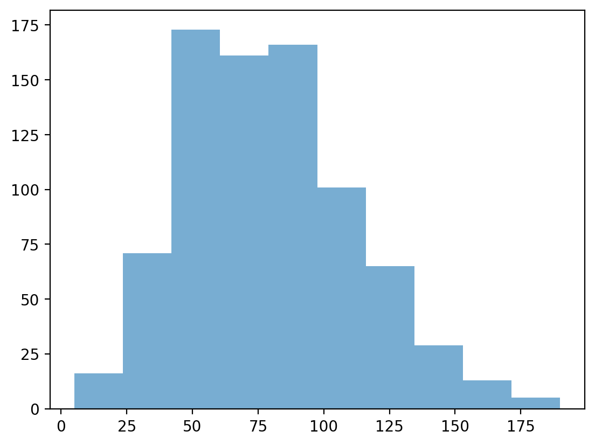
    


#### Check-in:

How would you make a histogram of the scores for `Defense`?


```python
### Your code here
p = plt.hist(df_pokemon['Defense'], alpha = .6)
```


    
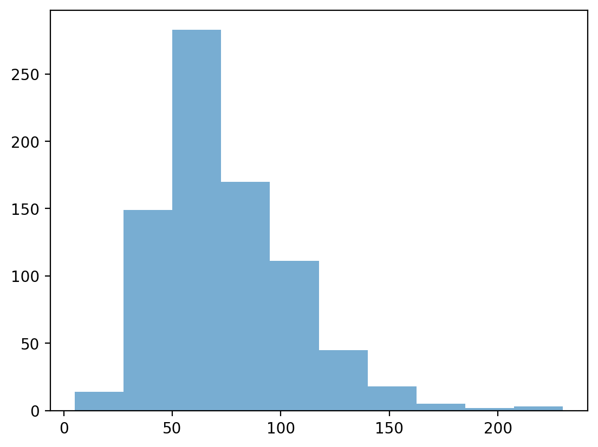
    


#### Check-in:

Could you make a histogram of the scores for `Type 1`?


```python
plt.figure(figsize=(14,8))
plt.hist(data=df_pokemon['Type 1'])
# type1 = (df_pokemon['Type 1']).value_counts()
# plt.bar(type1.index, type1.values)
```


    ---------------------------------------------------------------------------

    TypeError                                 Traceback (most recent call last)

    Cell In[10], line 2
          1 plt.figure(figsize=(14,8))
    ----> 2 plt.hist(data=df_pokemon['Type 1'])
          3 # type1 = (df_pokemon['Type 1']).value_counts()
          4 # plt.bar(type1.index, type1.values)
    

    File ~\AppData\Local\Packages\PythonSoftwareFoundation.Python.3.11_qbz5n2kfra8p0\LocalCache\local-packages\Python311\site-packages\matplotlib\_api\deprecation.py:453, in make_keyword_only.<locals>.wrapper(*args, **kwargs)
        447 if len(args) > name_idx:
        448     warn_deprecated(
        449         since, message="Passing the %(name)s %(obj_type)s "
        450         "positionally is deprecated since Matplotlib %(since)s; the "
        451         "parameter will become keyword-only in %(removal)s.",
        452         name=name, obj_type=f"parameter of {func.__name__}()")
    --> 453 return func(*args, **kwargs)
    

    TypeError: hist() missing 1 required positional argument: 'x'


    <Figure size 1400x800 with 0 Axes>


### Learning from histograms

Histograms are incredibly useful for learning about the **shape** of our distribution. We can ask questions like:

- Is this distribution relatively [normal](https://en.wikipedia.org/wiki/Normal_distribution)?
- Is the distribution [skewed](https://en.wikipedia.org/wiki/Skewness)?
- Are there [outliers](https://en.wikipedia.org/wiki/Outlier)?

#### Normally distributed data

We can use the `numpy.random.normal` function to create a **normal distribution**, then plot it.

A normal distribution has the following characteristics:

- Classic "bell" shape (**symmetric**).  
- Mean, median, and mode are all identical.


```python
norm = np.random.normal(loc = 10, scale = 1, size = 1000)
p = plt.hist(norm, alpha = .6)
```


    
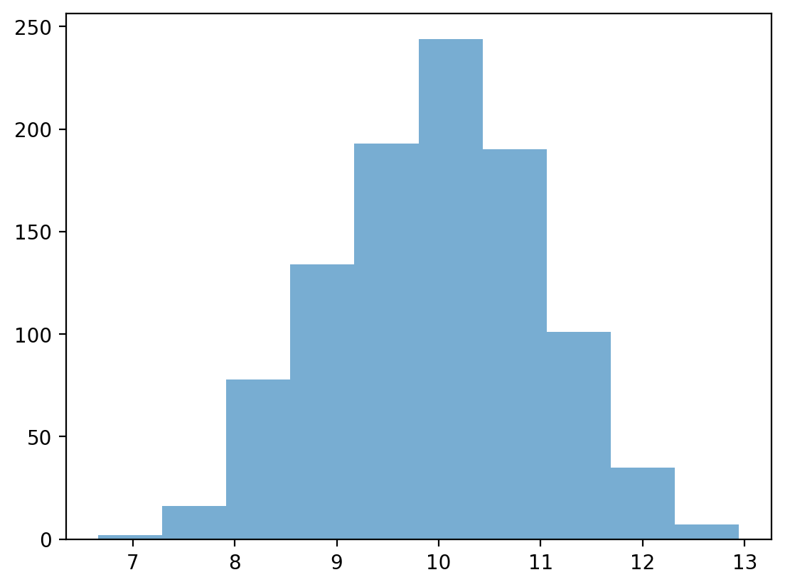
    


#### Skewed data

> **Skew** means there are values *elongating* one of the "tails" of a distribution.

- Positive/right skew: the tail is pointing to the right.  
- Negative/left skew: the tail is pointing to the left.


```python
rskew = ss.skewnorm.rvs(20, size = 1000) # make right-skewed data
lskew = ss.skewnorm.rvs(-20, size = 1000) # make left-skewed data
fig, axes = plt.subplots(1, 2)
axes[0].hist(rskew)
axes[0].set_title("Right-skewed")
axes[1].hist(lskew)
axes[1].set_title("Left-skewed")
```


    Text(0.5, 1.0, 'Left-skewed')


    
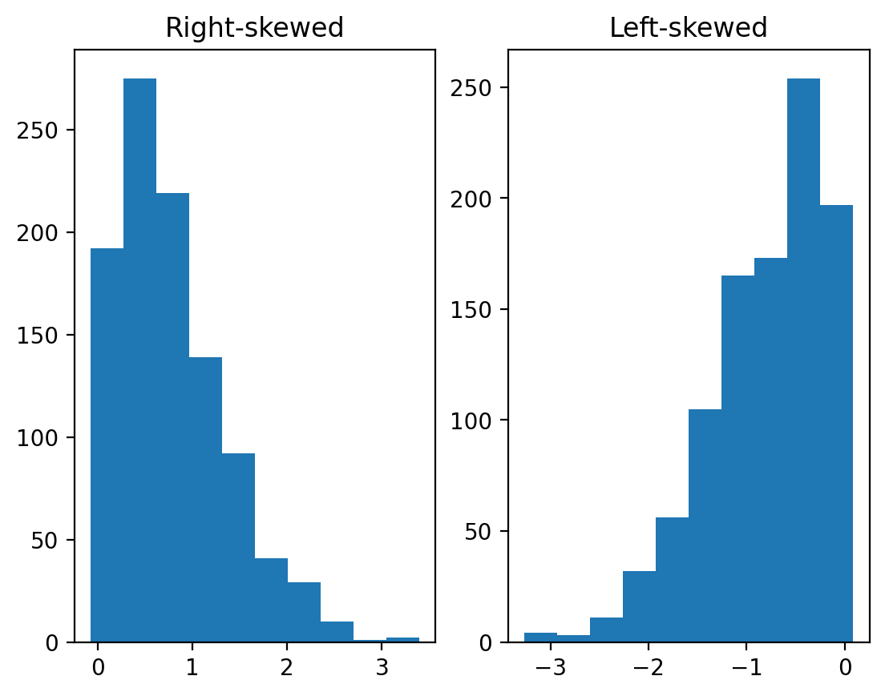
    


#### Outliers

> **Outliers** are data points that differ significantly from other points in a distribution.

- Unlike skewed data, outliers are generally **discontinuous** with the rest of the distribution.
- Next week, we'll talk about more ways to **identify** outliers; for now, we can rely on histograms.


```python
norm = np.random.normal(loc = 10, scale = 1, size = 1000)
upper_outliers = np.array([21, 21, 21, 21]) ## some random outliers
data = np.concatenate((norm, upper_outliers))
p = plt.hist(data, alpha = .6)
plt.arrow(20, 100, dx = 0, dy = -50, width = .3, head_length = 10, facecolor = "red")
```


    
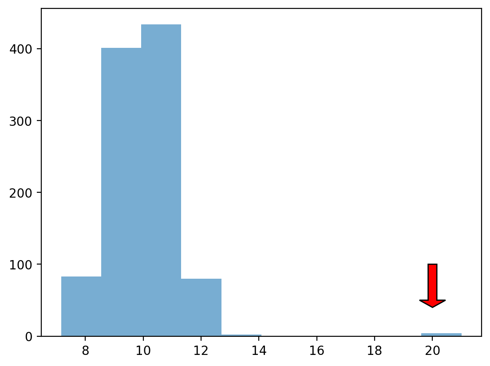
    


#### Check-in

How would you describe the following distribution?

- Normal vs. skewed?  
- With or without outliers?


```python
### Your code here
from scipy import stats
print(f"median: {np.median(data)}")
print(f"mean: {np.mean(data)}")
#i would describe following distribution as normal with outliers
```

    median: 9.965033632147573
    mean: 9.988636433675387
    

#### Check-in

In a somewhat **right-skewed distribution** (like below), what's larger––the `mean` or the `median`?


```python
mean1=np.mean(df_pokemon['Attack'])
median1=np.median(df_pokemon['Attack'])
print(mean1)
print(median1)
print(f"mean is larger than median: {mean1>median1}")
#according to the printed statement -> mean is larger than median in right-skewed distribution
```

    79.00125
    75.0
    mean is larger than median: True
    

### Modifying our plot

- A good data visualization should also make it *clear* what's being plotted.
   - Clearly labeled `x` and `y` axes, title.
- Sometimes, we may also want to add **overlays**. 
   - E.g., a dashed vertical line representing the `mean`.

#### Adding axis labels


```python
p = plt.hist(df_pokemon['Attack'], alpha = .6)
plt.xlabel("Attack")
plt.ylabel("Count")
plt.title("Distribution of Attack Scores")
```


    
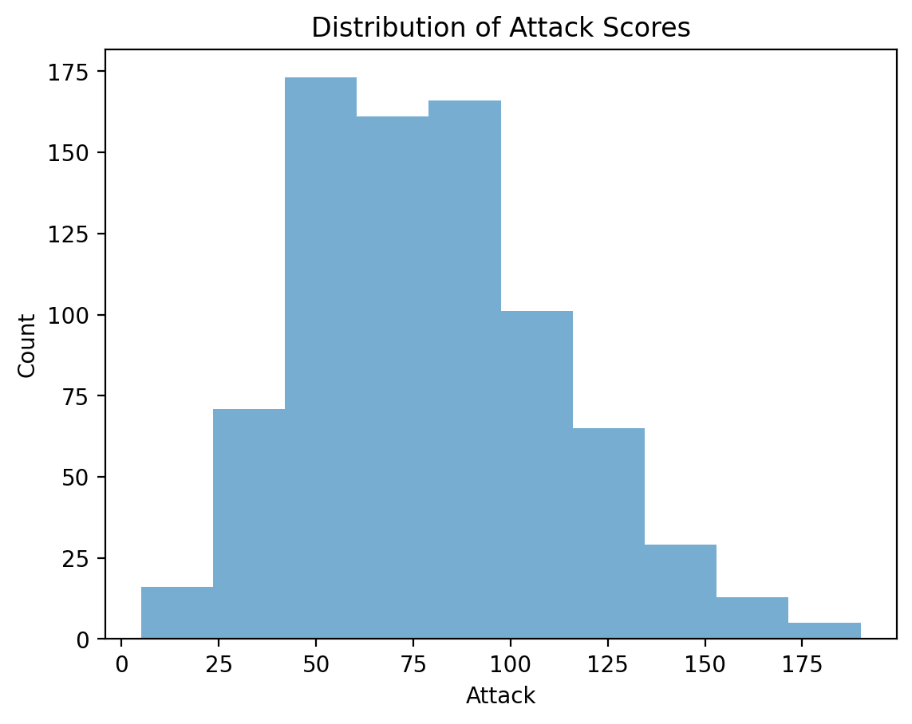
    


#### Adding a vertical line

The `plt.axvline` function allows us to draw a vertical line at a particular position, e.g., the `mean` of the `Attack` column.


```python
p = plt.hist(df_pokemon['Attack'], alpha = .6)
plt.xlabel("Attack")
plt.ylabel("Count")
plt.title("Distribution of Attack Scores")
plt.axvline(df_pokemon['Attack'].mean(), linestyle = "dotted")
```


    

    


## Faceting for histograms

Let's try to group by our no. of Attacks by Pokemon Types looking at many histograms at a time:


```python
import plotly.express as px
fig = px.histogram(df_pokemon,x='Attack', color="Legendary", facet_col='Generation')
fig.show()
```


    ---------------------------------------------------------------------------

    ModuleNotFoundError                       Traceback (most recent call last)

    Cell In[18], line 1
    ----> 1 import plotly.express as px
          2 fig = px.histogram(df_pokemon,x='Attack', color="Legendary", facet_col='Generation')
          3 fig.show()
    

    ModuleNotFoundError: No module named 'plotly'


## Scatterplots

### What are scatterplots?

> A **scatterplot** is a visualization of how two different continuous distributions relate to each other.

- Each individual point represents an observation.
- Very useful for **exploratory data analysis**.
   - Are these variables positively or negatively correlated?
   
A scatterplot is a **bivariate** plot, i.e., it displays at least two variables.

### Scatterplots with `matplotlib`

We can create a scatterplot using `plt.scatter(x, y)`, where `x` and `y` are the two variables we want to visualize.


```python
x = np.arange(1, 10)
y = np.arange(11, 20)
p = plt.scatter(x, y)
```


    

    


#### Check-in

Are these variables related? If so, how?


```python
x = np.random.normal(loc = 10, scale = 1, size = 100)
y = x * 2 + np.random.normal(loc = 0, scale = 2, size = 100)
plt.scatter(x, y, alpha = .6)
```


    
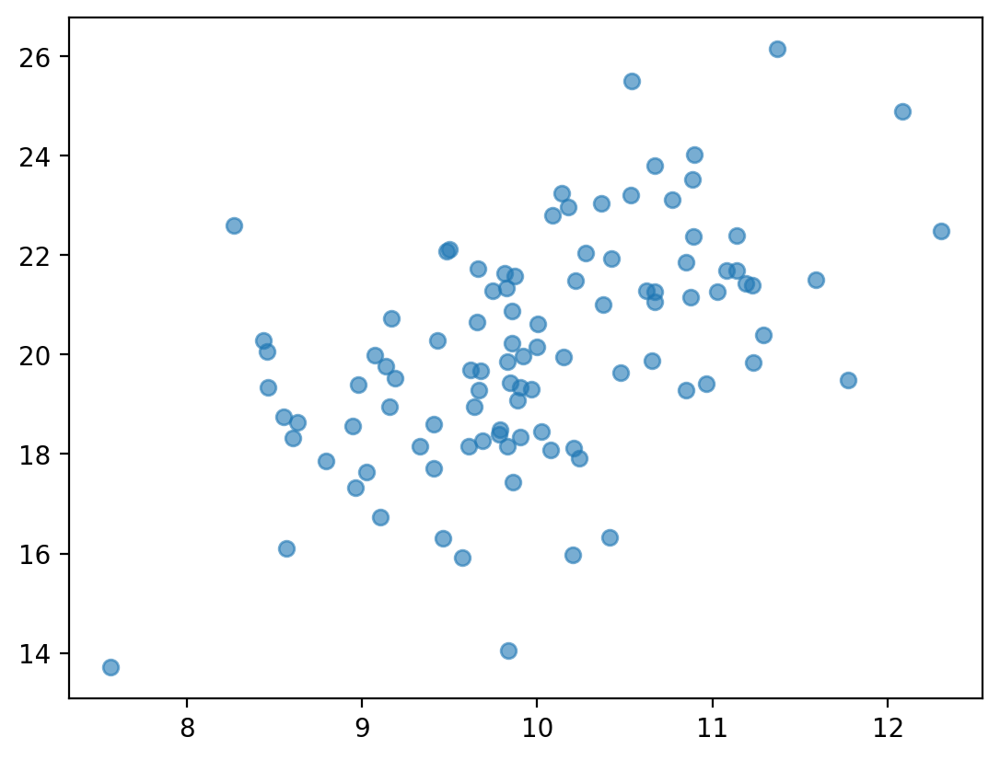
    


#### Check-in

Are these variables related? If so, how?


```python
x = np.random.normal(loc = 10, scale = 1, size = 100)
y = -x * 2 + np.random.normal(loc = 0, scale = 2, size = 100)
plt.scatter(x, y, alpha = .6)
```


    
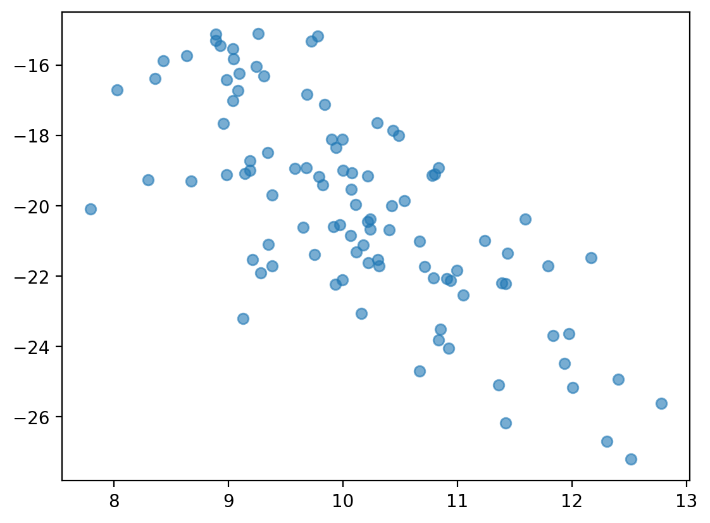
    


#### Scatterplots are useful for detecting non-linear relationships


```python
x = np.random.normal(loc = 10, scale = 1, size = 100)
y = np.sin(x)
plt.scatter(x, y, alpha = .6)
```


    
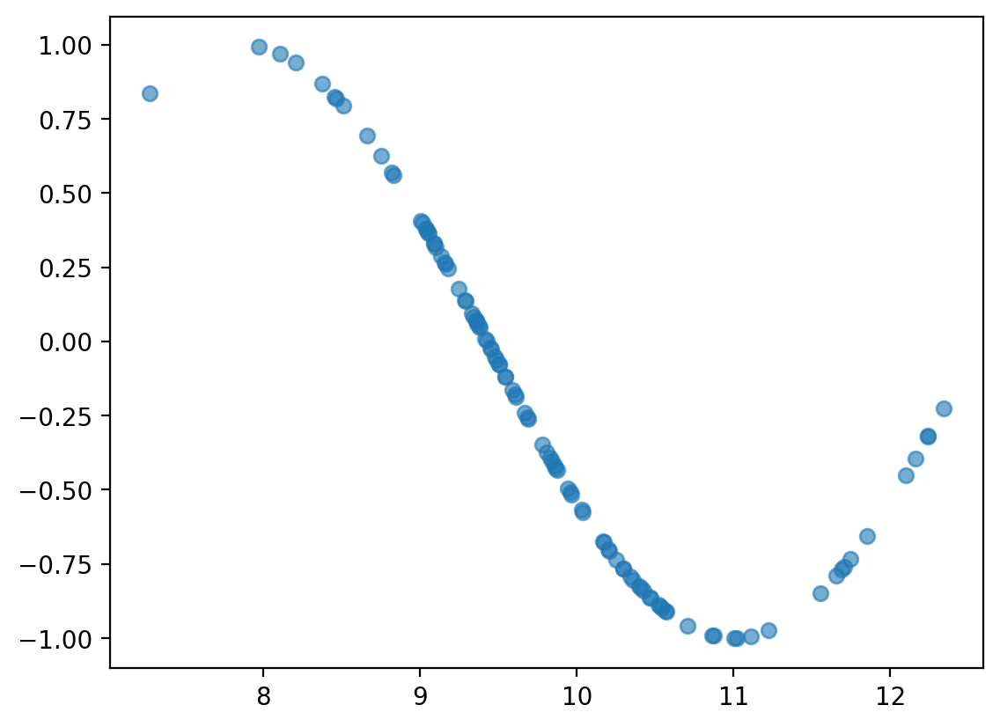
    


#### Check-in

How would we visualize the relationship between `Attack` and `Speed` in our Pokemon dataset?


```python
x = df_pokemon["Attack"]
y = df_pokemon["Speed"]
plt.xlabel("Attack")
plt.ylabel("Speed")
plt.title("Relation between Attack and Speed")
plt.scatter(x, y, alpha = .6)

```


    
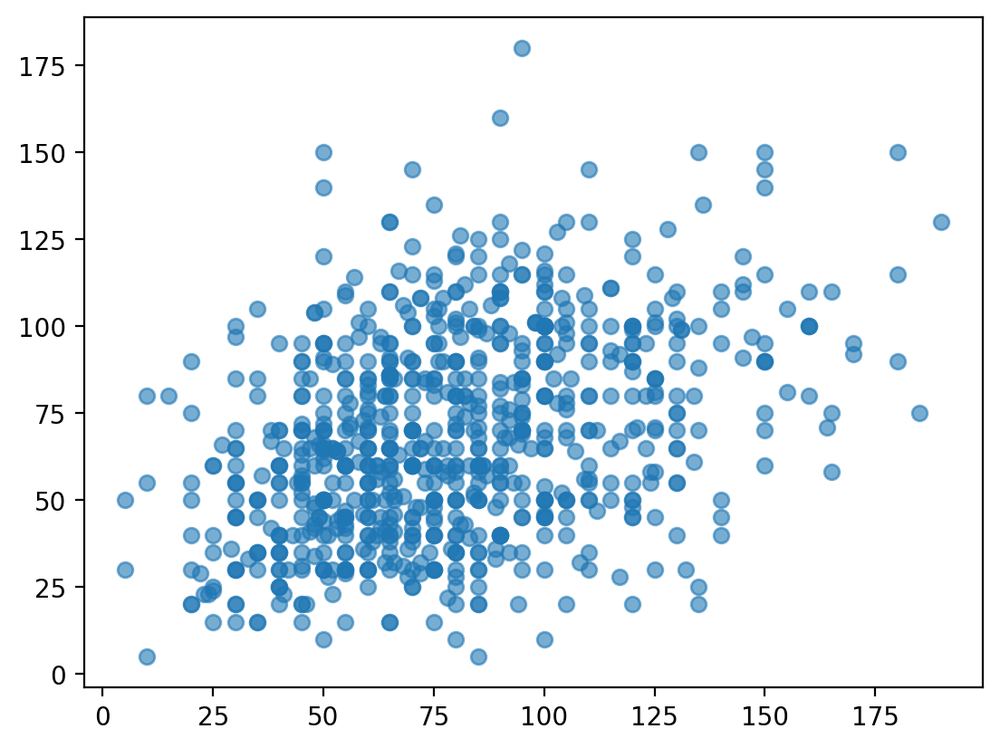
    


## Scatterplots with `pyplot express`

With pyplot express we can play with scatterplots even further - we can create `bubble plots`!


```python
import plotly.express as px
bubble=px.scatter(df_pokemon, x='Attack', y='Speed', color='Generation', size='HP')
bubble.show()
```


## Barplots

### What is a barplot?

> A **barplot** visualizes the relationship between one *continuous* variable and a *categorical* variable.

- The *height* of each bar generally indicates the mean of the continuous variable.
- Each bar represents a different *level* of the categorical variable.

A barplot is a **bivariate** plot, i.e., it displays at least two variables.

### Barplots with `matplotlib`

`plt.bar` can be used to create a **barplot** of our data.

- E.g., average `Attack` by `Legendary` status.
- However, we first need to use `groupby` to calculate the mean `Attack` per level.

#### Step 1: Using `groupby`


```python
summary = df_pokemon[['Legendary', 'Attack']].groupby("Legendary").mean().reset_index()
summary
```


<div>
<style scoped>
    .dataframe tbody tr th:only-of-type {
        vertical-align: middle;
    }

    .dataframe tbody tr th {
        vertical-align: top;
    }

    .dataframe thead th {
        text-align: right;
    }
</style>
<table border="1" class="dataframe">
  <thead>
    <tr style="text-align: right;">
      <th></th>
      <th>Legendary</th>
      <th>Attack</th>
    </tr>
  </thead>
  <tbody>
    <tr>
      <th>0</th>
      <td>False</td>
      <td>75.669388</td>
    </tr>
    <tr>
      <th>1</th>
      <td>True</td>
      <td>116.676923</td>
    </tr>
  </tbody>
</table>
</div>


```python
### Turn Legendary into a str
summary['Legendary'] = summary['Legendary'].apply(lambda x: str(x))
summary
```


<div>
<style scoped>
    .dataframe tbody tr th:only-of-type {
        vertical-align: middle;
    }

    .dataframe tbody tr th {
        vertical-align: top;
    }

    .dataframe thead th {
        text-align: right;
    }
</style>
<table border="1" class="dataframe">
  <thead>
    <tr style="text-align: right;">
      <th></th>
      <th>Legendary</th>
      <th>Attack</th>
    </tr>
  </thead>
  <tbody>
    <tr>
      <th>0</th>
      <td>False</td>
      <td>75.669388</td>
    </tr>
    <tr>
      <th>1</th>
      <td>True</td>
      <td>116.676923</td>
    </tr>
  </tbody>
</table>
</div>


#### Step 2: Pass values into `plt.bar`

**Check-in**:

- What do we learn from this plot?  
- What is this plot missing?


```python
plt.bar(x = summary['Legendary'],height = summary['Attack'],alpha = .6);
plt.xlabel("Legendary status")
plt.ylabel("Attack")
```


    Text(0, 0.5, 'Attack')


    
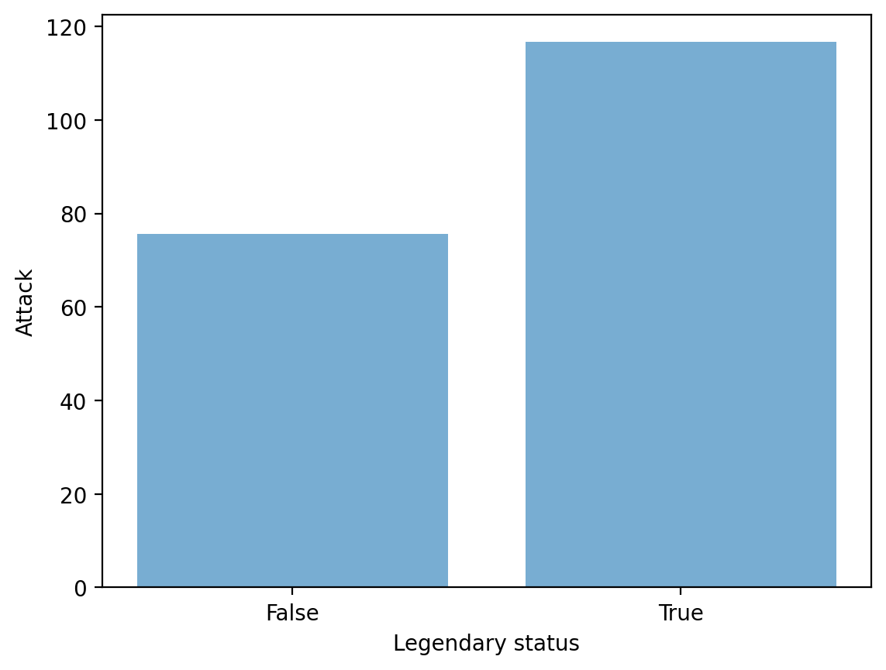
    


## Barplots in `plotly.express`


```python
import plotly.express as px
data_canada = px.data.gapminder().query("country == 'Canada'")
fig = px.bar(data_canada, x='year', y='pop')
fig.show()
```


```python
data_canada.head(3)
```


<div>
<style scoped>
    .dataframe tbody tr th:only-of-type {
        vertical-align: middle;
    }

    .dataframe tbody tr th {
        vertical-align: top;
    }

    .dataframe thead th {
        text-align: right;
    }
</style>
<table border="1" class="dataframe">
  <thead>
    <tr style="text-align: right;">
      <th></th>
      <th>country</th>
      <th>continent</th>
      <th>year</th>
      <th>lifeExp</th>
      <th>pop</th>
      <th>gdpPercap</th>
      <th>iso_alpha</th>
      <th>iso_num</th>
    </tr>
  </thead>
  <tbody>
    <tr>
      <th>240</th>
      <td>Canada</td>
      <td>Americas</td>
      <td>1952</td>
      <td>68.75</td>
      <td>14785584</td>
      <td>11367.16112</td>
      <td>CAN</td>
      <td>124</td>
    </tr>
    <tr>
      <th>241</th>
      <td>Canada</td>
      <td>Americas</td>
      <td>1957</td>
      <td>69.96</td>
      <td>17010154</td>
      <td>12489.95006</td>
      <td>CAN</td>
      <td>124</td>
    </tr>
    <tr>
      <th>242</th>
      <td>Canada</td>
      <td>Americas</td>
      <td>1962</td>
      <td>71.30</td>
      <td>18985849</td>
      <td>13462.48555</td>
      <td>CAN</td>
      <td>124</td>
    </tr>
  </tbody>
</table>
</div>


```python
long_df = px.data.medals_long()

fig = px.bar(long_df, x="nation", y="count", color="medal", title="Long format of data")
fig.show()

long_df.head(3)
```


<div>
<style scoped>
    .dataframe tbody tr th:only-of-type {
        vertical-align: middle;
    }

    .dataframe tbody tr th {
        vertical-align: top;
    }

    .dataframe thead th {
        text-align: right;
    }
</style>
<table border="1" class="dataframe">
  <thead>
    <tr style="text-align: right;">
      <th></th>
      <th>nation</th>
      <th>medal</th>
      <th>count</th>
    </tr>
  </thead>
  <tbody>
    <tr>
      <th>0</th>
      <td>South Korea</td>
      <td>gold</td>
      <td>24</td>
    </tr>
    <tr>
      <th>1</th>
      <td>China</td>
      <td>gold</td>
      <td>10</td>
    </tr>
    <tr>
      <th>2</th>
      <td>Canada</td>
      <td>gold</td>
      <td>9</td>
    </tr>
  </tbody>
</table>
</div>


```python
wide_df = px.data.medals_wide()

fig = px.bar(wide_df, x="nation", y=["gold", "silver", "bronze"], title="Wide format of data")
fig.show()

wide_df.head(3)
```


<div>
<style scoped>
    .dataframe tbody tr th:only-of-type {
        vertical-align: middle;
    }

    .dataframe tbody tr th {
        vertical-align: top;
    }

    .dataframe thead th {
        text-align: right;
    }
</style>
<table border="1" class="dataframe">
  <thead>
    <tr style="text-align: right;">
      <th></th>
      <th>nation</th>
      <th>gold</th>
      <th>silver</th>
      <th>bronze</th>
    </tr>
  </thead>
  <tbody>
    <tr>
      <th>0</th>
      <td>South Korea</td>
      <td>24</td>
      <td>13</td>
      <td>11</td>
    </tr>
    <tr>
      <th>1</th>
      <td>China</td>
      <td>10</td>
      <td>15</td>
      <td>8</td>
    </tr>
    <tr>
      <th>2</th>
      <td>Canada</td>
      <td>9</td>
      <td>12</td>
      <td>12</td>
    </tr>
  </tbody>
</table>
</div>


## Faceting barplots

Please use faceting for the Pokemon data with barplots:


```python
fig = px.bar(df_pokemon, x='Type 1', facet_row='Legendary')
fig.show()
 
```


For more information please go to the tutorial [Plotly Express Wide-Form Support in Python](https://plotly.com/python/wide-form/).

## Conclusion

This concludes our first introduction to **data visualization**:

- Working with `matplotlib.pyplot`.  
- Working with more convenient version of `pyplot.express`.
- Creating basic plots: histograms, scatterplots, and barplots.

Next time, we'll move onto discussing `seaborn`, another very useful package for data visualization.

Analysis of different data visualtisation graphs and methods.


```python
#1. Histogram
print("\nThis histogram shows that most HP values are around the mean and there are not so much extrem values.\nWe can can visually see that without calculating anything.")
fig = px.histogram(df_pokemon, x="HP", nbins=20, title="HP distribution among pokemons")
fig.show()

print("Now we will try to get those outliers with extreme HP values and plot them. We decided to take a threshold based on 1.5 times the interquartile range because it seemed like a reasonable choice to detect values that are far from the rest of the data.\n")

#Outliers for HP
Q1 = df_pokemon['HP'].quantile(0.25)#1st quartile
Q3 = df_pokemon['HP'].quantile(0.75)#3rd
pokeRangeQ1Q3 = Q3 - Q1

lower_bound = Q1 - 1.5 * pokeRangeQ1Q3
upper_bound = Q3 + 1.5 * pokeRangeQ1Q3
outliers = df_pokemon[(df_pokemon['HP'] < lower_bound) | (df_pokemon['HP'] > upper_bound)]
print(outliers[['Name', 'HP', 'Type 1']])


print("\n\nThis bubble plot helps us visualize where are the strong pokemons with big HP regarding the Attack Defense values.")
# Scatter plot for all pokemons
df_pokemon['is_outlier_HP'] = (df_pokemon['HP'] < lower_bound) | (df_pokemon['HP'] > upper_bound)

# Scatter plot
fig = px.scatter(df_pokemon,
                 x='Attack',
                 y='Defense',
                 size='HP',               
                 color='is_outlier_HP',# Color is different if outlier
                 hover_name='Name',        
                 title="Who has lot HP ")

fig.show()
```

    
    This histogram shows that most HP values are around the mean and there are not so much extrem values.
    We can can visually see that without calculating anything.
    


    Now we will try to get those outliers with extreme HP values and plot them. We decided to take a threshold based on 1.5 times the interquartile range because it seemed like a reasonable choice to detect values that are far from the rest of the data.
    
                          Name   HP    Type 1
    45              Wigglytuff  140    Normal
    121                Chansey  250    Normal
    142                 Lapras  130     Water
    145               Vaporeon  130     Water
    155                Snorlax  160    Normal
    217              Wobbuffet  190   Psychic
    261                Blissey  255    Normal
    313                Slaking  150    Normal
    316               Shedinja    1       Bug
    321               Hariyama  144  Fighting
    350                Wailmer  130     Water
    351                Wailord  170     Water
    473               Drifblim  150     Ghost
    495               Munchlax  135    Normal
    544  GiratinaAltered Forme  150     Ghost
    545   GiratinaOrigin Forme  150     Ghost
    655              Alomomola  165     Water
    792                Xerneas  126     Fairy
    793                Yveltal  126      Dark
    
    
    This bubble plot helps us visualize where are the strong pokemons with big HP regarding the Attack Defense values.
    


```python
# Bar plot of outliers HP

print("\nAdditionally, we can compare the outliers defined above to each other.")
print("We can easily visualize that most outliers have a similar amount of HP.")
print("However, 3 Pokemon stand out: Chansey, Blissey, and Shedinja. The two first\nones are very big whereas Shedinja is very fragile !")

fig = px.bar(outliers, 
             x='Name', 
             y='HP', 
             color='Type 1', 
             title='Pokemon with extreme HP Values (outliers)',
             labels={'HP':'HP Value', 'Name':'Pokémon Name'})

fig.update_layout(xaxis_tickangle=-45)
fig.show()
```

    
    Additionally, we can compare the outliers defined above to each other.
    We can easily visualize that most outliers have a similar amount of HP.
    However, 3 Pokemon stand out: Chansey, Blissey, and Shedinja. The two first
    ones are very big whereas Shedinja is very fragile !
    


