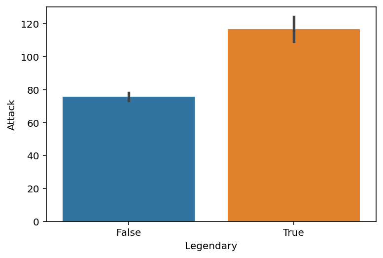

# Data visualization, pt. 2 (`seaborn`)

## Goals of this exercise

- Introducting `seaborn`. 
- Putting `seaborn` into practice:
  - **Univariate** plots (histograms).  
  - **Bivariate** continuous plots (scatterplots and line plots).
  - **Bivariate** categorical plots (bar plots, box plots, and strip plots).

## Introducing `seaborn`

### What is `seaborn`?

> [`seaborn`](https://seaborn.pydata.org/) is a data visualization library based on `matplotlib`.

- In general, it's easier to make nice-looking graphs with `seaborn`.
- The trade-off is that `matplotlib` offers more flexibility.


```python
import seaborn as sns ### importing seaborn
import pandas as pd
import matplotlib.pyplot as plt ## just in case we need it
import numpy as np
```


```python
%matplotlib inline 
%config InlineBackend.figure_format = 'retina'
```

### The `seaborn` hierarchy of plot types

We'll learn more about exactly what this hierarchy means today (and in next lecture).


### Example dataset

Today we'll work with a new dataset, from [Gapminder](https://www.gapminder.org/data/documentation/). 

- **Gapminder** is an independent Swedish foundation dedicated to publishing and analyzing data to correct misconceptions about the world.
- Between 1952-2007, has data about `life_exp`, `gdp_cap`, and `population`.


```python
df_gapminder = pd.read_csv("gapminder_full.csv")
```


    ---------------------------------------------------------------------------

    FileNotFoundError                         Traceback (most recent call last)

    ~\AppData\Local\Temp/ipykernel_45568/1205863771.py in <module>
    ----> 1 df_gapminder = pd.read_csv("gapminder_full.csv")
    

    ~\anaconda3\lib\site-packages\pandas\util\_decorators.py in wrapper(*args, **kwargs)
        309                     stacklevel=stacklevel,
        310                 )
    --> 311             return func(*args, **kwargs)
        312 
        313         return wrapper
    

    ~\anaconda3\lib\site-packages\pandas\io\parsers\readers.py in read_csv(filepath_or_buffer, sep, delimiter, header, names, index_col, usecols, squeeze, prefix, mangle_dupe_cols, dtype, engine, converters, true_values, false_values, skipinitialspace, skiprows, skipfooter, nrows, na_values, keep_default_na, na_filter, verbose, skip_blank_lines, parse_dates, infer_datetime_format, keep_date_col, date_parser, dayfirst, cache_dates, iterator, chunksize, compression, thousands, decimal, lineterminator, quotechar, quoting, doublequote, escapechar, comment, encoding, encoding_errors, dialect, error_bad_lines, warn_bad_lines, on_bad_lines, delim_whitespace, low_memory, memory_map, float_precision, storage_options)
        584     kwds.update(kwds_defaults)
        585 
    --> 586     return _read(filepath_or_buffer, kwds)
        587 
        588 
    

    ~\anaconda3\lib\site-packages\pandas\io\parsers\readers.py in _read(filepath_or_buffer, kwds)
        480 
        481     # Create the parser.
    --> 482     parser = TextFileReader(filepath_or_buffer, **kwds)
        483 
        484     if chunksize or iterator:
    

    ~\anaconda3\lib\site-packages\pandas\io\parsers\readers.py in __init__(self, f, engine, **kwds)
        809             self.options["has_index_names"] = kwds["has_index_names"]
        810 
    --> 811         self._engine = self._make_engine(self.engine)
        812 
        813     def close(self):
    

    ~\anaconda3\lib\site-packages\pandas\io\parsers\readers.py in _make_engine(self, engine)
       1038             )
       1039         # error: Too many arguments for "ParserBase"
    -> 1040         return mapping[engine](self.f, **self.options)  # type: ignore[call-arg]
       1041 
       1042     def _failover_to_python(self):
    

    ~\anaconda3\lib\site-packages\pandas\io\parsers\c_parser_wrapper.py in __init__(self, src, **kwds)
         49 
         50         # open handles
    ---> 51         self._open_handles(src, kwds)
         52         assert self.handles is not None
         53 
    

    ~\anaconda3\lib\site-packages\pandas\io\parsers\base_parser.py in _open_handles(self, src, kwds)
        220         Let the readers open IOHandles after they are done with their potential raises.
        221         """
    --> 222         self.handles = get_handle(
        223             src,
        224             "r",
    

    ~\anaconda3\lib\site-packages\pandas\io\common.py in get_handle(path_or_buf, mode, encoding, compression, memory_map, is_text, errors, storage_options)
        700         if ioargs.encoding and "b" not in ioargs.mode:
        701             # Encoding
    --> 702             handle = open(
        703                 handle,
        704                 ioargs.mode,
    

    FileNotFoundError: [Errno 2] No such file or directory: 'gapminder_full.csv'


```python
df_gapminder.head(2)
```


```python
df_gapminder.shape
```

## Univariate plots

> A **univariate plot** is a visualization of only a *single* variable, i.e., a **distribution**.


### Histograms with `sns.histplot`

- We've produced histograms with `plt.hist`.  
- With `seaborn`, we can use `sns.histplot(...)`.

Rather than use `df['col_name']`, we can use the syntax:

```python
sns.histplot(data = df, x = col_name)
```

This will become even more useful when we start making **bivariate plots**.


```python
# Histogram of life expectancy
sns.histplot(df_gapminder['life_exp']);
```

#### Modifying the number of bins

As with `plt.hist`, we can modify the number of *bins*.


```python
# Fewer bins
sns.histplot(data = df_gapminder, x = 'life_exp', bins = 10, alpha = .6);
```


```python
# Many more bins!
sns.histplot(data = df_gapminder, x = 'life_exp', bins = 100, alpha = .6)
```

#### Modifying the y-axis with `stat`

By default, `sns.histplot` will plot the **count** in each bin. However, we can change this using the `stat` parameter:

- `probability`: normalize such that bar heights sum to `1`.
- `percent`: normalize such that bar heights sum to `100`.
- `density`: normalize such that total *area* sums to `1`.


```python
# Note the modified y-axis!
sns.histplot(data = df_gapminder, x = 'life_exp', stat = "probability", alpha = .6)
```


    ---------------------------------------------------------------------------

    NameError                                 Traceback (most recent call last)

    ~\AppData\Local\Temp/ipykernel_45568/693073458.py in <module>
          1 # Note the modified y-axis!
    ----> 2 sns.histplot(data = df_gapminder, x = 'life_exp', stat = "probability", alpha = .6)
    

    NameError: name 'df_gapminder' is not defined


### Check-in

How would you make a histogram showing the distribution of `population` values in `2007` alone? 

- Bonus 1: Modify this graph to show `probability`, not `count`.
- Bonus 2: What do you notice about this graph, and how might you change it?


```python
df_2007 = df_gapminder[df_gapminder['year'] == 2007]

# changing xscale to 'log'(from the default 'linear') made the graph more readable
# before the change we could observe that the majority of the countries had a small population in 2007
# but there were some countries whose population then was significantly bigger which caused
# that a lot of data was squeezed on the left side and some singular data was shown on the far right
# changing to 'log' spreaded every singular datum so that they're more or less near one another

plt.figure(figsize=(10,6))
sns.histplot(data=df_2007, x='population', stat='probability', bins=50)
plt.xscale('log')
plt.title('Distribution of Population in 2007 (Probability)')
plt.xlabel('Population')
plt.ylabel('Probability')
plt.show()

plt.figure(figsize=(10,6))
sns.histplot(data=df_2007, x='population', bins=50)
plt.xscale('log')
plt.title('Distribution of Population in 2007')
plt.xlabel('Population')
plt.ylabel('Count')
plt.show()
```


    ---------------------------------------------------------------------------

    NameError                                 Traceback (most recent call last)

    ~\AppData\Local\Temp/ipykernel_45568/3641876699.py in <module>
    ----> 1 df_2007 = df_gapminder[df_gapminder['year'] == 2007]
          2 
          3 # changing xscale to 'log'(from the default 'linear') made the graph more readable
          4 # before the change we could observe that the majority of the countries had a small population in 2007
          5 # but there were some countries whose population then was significantly bigger which caused
    

    NameError: name 'df_gapminder' is not defined


## Bivariate continuous plots

> A **bivariate continuous plot** visualizes the relationship between *two continuous variables*.


### Scatterplots with `sns.scatterplot`

> A **scatterplot** visualizes the relationship between two continuous variables.

- Each observation is plotted as a single dot/mark. 
- The position on the `(x, y)` axes reflects the value of those variables.

One way to make a scatterplot in `seaborn` is using `sns.scatterplot`.

#### Showing `gdp_cap` by `life_exp`

What do we notice about `gdp_cap`?


```python
sns.scatterplot(data = df_gapminder, x = 'gdp_cap',
               y = 'life_exp', alpha = .3);
```


    ---------------------------------------------------------------------------

    NameError                                 Traceback (most recent call last)

    ~\AppData\Local\Temp/ipykernel_45568/960769122.py in <module>
    ----> 1 sns.scatterplot(data = df_gapminder, x = 'gdp_cap',
          2                y = 'life_exp', alpha = .3);
    

    NameError: name 'df_gapminder' is not defined


#### Showing `gdp_cap_log` by `life_exp`


```python
## Log GDP
df_gapminder['gdp_cap_log'] = np.log10(df_gapminder['gdp_cap']) 
## Show log GDP by life exp
sns.scatterplot(data = df_gapminder, x = 'gdp_cap_log', y = 'life_exp', alpha = .3);
```


    ---------------------------------------------------------------------------

    NameError                                 Traceback (most recent call last)

    ~\AppData\Local\Temp/ipykernel_45568/1354961121.py in <module>
          1 ## Log GDP
    ----> 2 df_gapminder['gdp_cap_log'] = np.log10(df_gapminder['gdp_cap'])
          3 ## Show log GDP by life exp
          4 sns.scatterplot(data = df_gapminder, x = 'gdp_cap_log', y = 'life_exp', alpha = .3);
    

    NameError: name 'df_gapminder' is not defined


#### Adding a `hue`

- What if we want to add a *third* component that's categorical, like `continent`?
- `seaborn` allows us to do this with `hue`.


```python
## Log GDP
df_gapminder['gdp_cap_log'] = np.log10(df_gapminder['gdp_cap']) 
## Show log GDP by life exp
sns.scatterplot(data = df_gapminder[df_gapminder['year'] == 2007],
               x = 'gdp_cap_log', y = 'life_exp', hue = "continent", alpha = .7);
```


    ---------------------------------------------------------------------------

    NameError                                 Traceback (most recent call last)

    ~\AppData\Local\Temp/ipykernel_45568/2210440022.py in <module>
          1 ## Log GDP
    ----> 2 df_gapminder['gdp_cap_log'] = np.log10(df_gapminder['gdp_cap'])
          3 ## Show log GDP by life exp
          4 sns.scatterplot(data = df_gapminder[df_gapminder['year'] == 2007],
          5                x = 'gdp_cap_log', y = 'life_exp', hue = "continent", alpha = .7);
    

    NameError: name 'df_gapminder' is not defined


#### Adding a `size`

- What if we want to add a *fourth* component that's continuous, like `population`?
- `seaborn` allows us to do this with `size`.


```python
## Log GDP
df_gapminder['gdp_cap_log'] = np.log10(df_gapminder['gdp_cap']) 
## Show log GDP by life exp
sns.scatterplot(data = df_gapminder[df_gapminder['year'] == 2007],
               x = 'gdp_cap_log', y = 'life_exp',
                hue = "continent", size = 'population', alpha = .7);
```


    ---------------------------------------------------------------------------

    NameError                                 Traceback (most recent call last)

    ~\AppData\Local\Temp/ipykernel_45568/2557269679.py in <module>
          1 ## Log GDP
    ----> 2 df_gapminder['gdp_cap_log'] = np.log10(df_gapminder['gdp_cap'])
          3 ## Show log GDP by life exp
          4 sns.scatterplot(data = df_gapminder[df_gapminder['year'] == 2007],
          5                x = 'gdp_cap_log', y = 'life_exp',
    

    NameError: name 'df_gapminder' is not defined


#### Changing the position of the legend


```python
## Show log GDP by life exp
sns.scatterplot(data = df_gapminder[df_gapminder['year'] == 2007],
               x = 'gdp_cap_log', y = 'life_exp',
                hue = "continent", size = 'population', alpha = .7)

plt.legend(bbox_to_anchor=(1.05, 1), loc='upper left', borderaxespad=0)
```


    <matplotlib.legend.Legend at 0x1b3175b3b50>


    

    


### Lineplots with `sns.lineplot`

> A **lineplot** also visualizes the relationship between two continuous variables.

- Typically, the position of the line on the `y` axis reflects the *mean* of the `y`-axis variable for that value of `x`.
- Often used for plotting **change over time**.

One way to make a lineplot in `seaborn` is using [`sns.lineplot`](https://seaborn.pydata.org/generated/seaborn.lineplot.html).

#### Showing `life_exp` by `year`

What general trend do we notice?


```python
sns.lineplot(data = df_gapminder,
             x = 'year',
             y = 'life_exp');
```


    

    


#### Modifying how error/uncertainty is displayed

- By default, `seaborn.lineplot` will draw **shading** around the line representing a confidence interval.
- We can change this with `errstyle`.


```python
sns.lineplot(data = df_gapminder,
             x = 'year',
             y = 'life_exp',
            err_style = "bars");
```


    

    


#### Adding a `hue`

- We could also show this by `continent`.  
- There's (fortunately) a positive trend line for each `continent`.


```python
sns.lineplot(data = df_gapminder,
             x = 'year',
             y = 'life_exp',
            hue = "continent")
plt.legend(bbox_to_anchor=(1.05, 1), loc='upper left', borderaxespad=0)
```


    <matplotlib.legend.Legend at 0x1b30f113cd0>


    

    


#### Check-in

How would you plot the relationship between `year` and `gdp_cap` for countries in the `Americas` only?


```python
### Your code here
americasGDP_df = df_gapminder[df_gapminder['continent'] == 'Americas']

sns.lineplot(data=americasGDP_df,
             x = "year", 
             y = "gdp_cap",
             hue = "country")
plt.legend(bbox_to_anchor=(1.05, 1), loc='upper left', borderaxespad=0)
plt.title("GDP per country by years (lineplot)")

plt.figure()

sns.scatterplot(data=americasGDP_df,
                x = "year",
                y = "gdp_cap",
                hue = "country",
                size="population")
plt.legend(bbox_to_anchor=(1.05, 1), loc='upper left', borderaxespad=0)

pivot_table = americasGDP_df.pivot_table(values='gdp_cap', index='country', columns='year')

plt.figure(figsize=(14, 10))
sns.heatmap(pivot_table,
            cmap='viridis',
            linewidths=0.5,
            annot=False)
plt.title('GDP per Capita Heatmap for Americas')
plt.xlabel('Year')
plt.ylabel('Country')
plt.tight_layout()
plt.show()

# for me the easiest graph to decipher is the heatmap, it may be slightly harder to 
# see rise/fall of GDP in comparison to other countries however with so many
# countries to show on a graph the heatmap is the clearest for seeing every data

```


    

    


    

    


    

    


#### Heteroskedasticity in `gdp_cap` by `year`

- [**Heteroskedasticity**](https://en.wikipedia.org/wiki/Homoscedasticity_and_heteroscedasticity) is when the *variance* in one variable (e.g., `gdp_cap`) changes as a function of another variable (e.g., `year`).
- In this case, why do you think that is?

#### Plotting by country

- There are too many countries to clearly display in the `legend`. 
- But the top two lines are the `United States` and `Canada`.
   - I.e., two countries have gotten much wealthier per capita, while the others have not seen the same economic growth.


```python
sns.lineplot(data = df_gapminder[df_gapminder['continent']=="Americas"],
             x = 'year', y = 'gdp_cap', hue = "country", legend = None);
```


    

    


### Using `replot`

- `relplot` allows you to plot either line plots or scatter plots using `kind`.
- `relplot` also makes it easier to `facet` (which we'll discuss momentarily).


```python
sns.relplot(data = df_gapminder, x = "year", y = "life_exp", kind = "line");
```


    

    


#### Faceting into `rows` and `cols`

We can also plot the same relationship across multiple "windows" or **facets** by adding a `rows`/`cols` parameter.


```python
sns.relplot(data = df_gapminder, x = "year", y = "life_exp", kind = "line", col = "continent");
```


    

    


## Bivariate categorical plots

> A **bivariate categorical plot** visualizes the relationship between one categorical variable and one continuous variable.


### Example dataset

Here, we'll return to our Pokemon dataset, which has more examples of categorical variables.


```python
df_pokemon = pd.read_csv("pokemon.csv")
```


    ---------------------------------------------------------------------------

    FileNotFoundError                         Traceback (most recent call last)

    ~\AppData\Local\Temp/ipykernel_45568/4226952659.py in <module>
    ----> 1 df_pokemon = pd.read_csv("pokemon.csv")
    

    ~\anaconda3\lib\site-packages\pandas\util\_decorators.py in wrapper(*args, **kwargs)
        309                     stacklevel=stacklevel,
        310                 )
    --> 311             return func(*args, **kwargs)
        312 
        313         return wrapper
    

    ~\anaconda3\lib\site-packages\pandas\io\parsers\readers.py in read_csv(filepath_or_buffer, sep, delimiter, header, names, index_col, usecols, squeeze, prefix, mangle_dupe_cols, dtype, engine, converters, true_values, false_values, skipinitialspace, skiprows, skipfooter, nrows, na_values, keep_default_na, na_filter, verbose, skip_blank_lines, parse_dates, infer_datetime_format, keep_date_col, date_parser, dayfirst, cache_dates, iterator, chunksize, compression, thousands, decimal, lineterminator, quotechar, quoting, doublequote, escapechar, comment, encoding, encoding_errors, dialect, error_bad_lines, warn_bad_lines, on_bad_lines, delim_whitespace, low_memory, memory_map, float_precision, storage_options)
        584     kwds.update(kwds_defaults)
        585 
    --> 586     return _read(filepath_or_buffer, kwds)
        587 
        588 
    

    ~\anaconda3\lib\site-packages\pandas\io\parsers\readers.py in _read(filepath_or_buffer, kwds)
        480 
        481     # Create the parser.
    --> 482     parser = TextFileReader(filepath_or_buffer, **kwds)
        483 
        484     if chunksize or iterator:
    

    ~\anaconda3\lib\site-packages\pandas\io\parsers\readers.py in __init__(self, f, engine, **kwds)
        809             self.options["has_index_names"] = kwds["has_index_names"]
        810 
    --> 811         self._engine = self._make_engine(self.engine)
        812 
        813     def close(self):
    

    ~\anaconda3\lib\site-packages\pandas\io\parsers\readers.py in _make_engine(self, engine)
       1038             )
       1039         # error: Too many arguments for "ParserBase"
    -> 1040         return mapping[engine](self.f, **self.options)  # type: ignore[call-arg]
       1041 
       1042     def _failover_to_python(self):
    

    ~\anaconda3\lib\site-packages\pandas\io\parsers\c_parser_wrapper.py in __init__(self, src, **kwds)
         49 
         50         # open handles
    ---> 51         self._open_handles(src, kwds)
         52         assert self.handles is not None
         53 
    

    ~\anaconda3\lib\site-packages\pandas\io\parsers\base_parser.py in _open_handles(self, src, kwds)
        220         Let the readers open IOHandles after they are done with their potential raises.
        221         """
    --> 222         self.handles = get_handle(
        223             src,
        224             "r",
    

    ~\anaconda3\lib\site-packages\pandas\io\common.py in get_handle(path_or_buf, mode, encoding, compression, memory_map, is_text, errors, storage_options)
        700         if ioargs.encoding and "b" not in ioargs.mode:
        701             # Encoding
    --> 702             handle = open(
        703                 handle,
        704                 ioargs.mode,
    

    FileNotFoundError: [Errno 2] No such file or directory: 'pokemon.csv'


### Barplots with `sns.barplot`

> A **barplot** visualizes the relationship between one *continuous* variable and a *categorical* variable.

- The *height* of each bar generally indicates the mean of the continuous variable.
- Each bar represents a different *level* of the categorical variable.

With `seaborn`, we can use the function `sns.barplot`.

#### Average `Attack` by `Legendary` status


```python
sns.barplot(data = df_pokemon,
           x = "Legendary", y = "Attack");
```


    

    


#### Average `Attack` by `Type 1`

Here, notice that I make the figure *bigger*, to make sure the labels all fit.


```python
plt.figure(figsize=(15,4))
sns.barplot(data = df_pokemon,
           x = "Type 1", y = "Attack");
```


    

    


#### Check-in

How would you plot `HP` by `Type 1`?


```python
### Your code here
plt.figure(figsize=(15,4))
sns.barplot(data = df_pokemon,
           x = "Type 1", y = "HP");

```


    

    


#### Modifying `hue`

As with `scatterplot` and `lineplot`, we can change the `hue` to give further granularity.

- E.g., `HP` by `Type 1`, further divided by `Legendary` status.


```python
plt.figure(figsize=(15,4))
sns.barplot(data = df_pokemon,
           x = "Type 1", y = "HP", hue = "Legendary");
```


    

    


### Using `catplot`

> `seaborn.catplot` is a convenient function for plotting bivariate categorical data using a range of plot types (`bar`, `box`, `strip`).


```python
sns.catplot(data = df_pokemon, x = "Legendary", 
             y = "Attack", kind = "bar");
```


    

    


#### `strip` plots

> A `strip` plot shows each individual point (like a scatterplot), divided by a **category label**.


```python
sns.catplot(data = df_pokemon, x = "Legendary", 
             y = "Attack", kind = "strip", alpha = .5);
```


    

    


#### Adding a `mean` to our `strip` plot

We can plot *two graphs* at the same time, showing both the individual points and the means.


```python
sns.catplot(data = df_pokemon, x = "Legendary", 
             y = "Attack", kind = "strip", alpha = .1)
sns.pointplot(data = df_pokemon, x = "Legendary", 
             y = "Attack", hue = "Legendary");
```


    

    


#### `box` plots

> A `box` plot shows the interquartile range (the middle 50% of the data), along with the minimum and maximum.


```python
sns.catplot(data = df_pokemon, x = "Legendary", 
             y = "Attack", kind = "box");
```


    

    


## Conclusion

As with our lecture on `pyplot`, this just scratches the surface.

But now, you've had an introduction to:

- The `seaborn` package.
- Plotting both **univariate** and **bivariate** data.
- Creating plots with multiple layers.
