# Data visualization in Python (`pyplot`)

## Looking ahead: April, Weeks 1-2

- In April, weeks 1-2, we'll dive deep into **data visualization**.  
  - How do we make visualizations in Python?
  - What principles should we keep in mind?

## Goals of this exercise

- What *is* data visualization and why is it important?
- Introducing `matplotlib`.
- Univariate plot types:
  - **Histograms** (univariate).
  - **Scatterplots** (bivariate).
  - **Bar plots** (bivariate).

## Introduction: data visualization

### What is data visualization?

[Data visualization](https://en.wikipedia.org/wiki/Data_visualization) refers to the process (and result) of representing data graphically.

For our purposes today, we'll be talking mostly about common methods of **plotting** data, including:

- Histograms  
- Scatterplots  
- Line plots
- Bar plots

### Why is data visualization important?

- Exploratory data analysis
- Communicating insights
- Impacting the world

### Exploratory Data Analysis: Checking your assumptions 

[Anscombe's Quartet](https://en.wikipedia.org/wiki/Anscombe%27s_quartet)


### Communicating Insights

[Reference: Full Stack Economics](https://fullstackeconomics.com/18-charts-that-explain-the-american-economy/)


### Impacting the world

[Florence Nightingale](https://en.wikipedia.org/wiki/Florence_Nightingale) (1820-1910) was a social reformer, statistician, and founder of modern nursing.


### Impacting the world (pt. 2)

[John Snow](https://en.wikipedia.org/wiki/John_Snow) (1813-1858) was a physician whose visualization of cholera outbreaks helped identify the source and spreading mechanism (water supply). 


## Introducing `matplotlib`

### Loading packages

Here, we load the core packages we'll be using. 

We also add some lines of code that make sure our visualizations will plot "inline" with our code, and that they'll have nice, crisp quality.


```python
import numpy as np 
import pandas as pd
import matplotlib.pyplot as plt
import scipy.stats as ss
```


```python
%matplotlib inline 
%config InlineBackend.figure_format = 'retina'
```

### What is `matplotlib`?

> [`matplotlib`](https://matplotlib.org/) is a **plotting library** for Python.

- Many [tutorials](https://matplotlib.org/stable/tutorials/index.html) available online.  
- Also many [examples](https://matplotlib.org/stable/gallery/index) of `matplotlib` in use.

Note that [`seaborn`](https://seaborn.pydata.org/) (which we'll cover soon) uses `matplotlib` "under the hood".

### What is `pyplot`?

> [`pyplot`](https://matplotlib.org/stable/tutorials/introductory/pyplot.html) is a collection of functions *within* `matplotlib` that make it really easy to plot data.

With `pyplot`, we can easily plot things like:

- Histograms (`plt.hist`)
- Scatterplots (`plt.scatter`)
- Line plots (`plt.plot`) 
- Bar plots (`plt.bar`)

### Example dataset

Let's load our familiar Pokemon dataset, which can be found in `data/pokemon.csv`.


```python
df_pokemon = pd.read_csv("pokemon.csv")
df_pokemon.head(10)
```


<div>
<style scoped>
    .dataframe tbody tr th:only-of-type {
        vertical-align: middle;
    }

    .dataframe tbody tr th {
        vertical-align: top;
    }

    .dataframe thead th {
        text-align: right;
    }
</style>
<table border="1" class="dataframe">
  <thead>
    <tr style="text-align: right;">
      <th></th>
      <th>#</th>
      <th>Name</th>
      <th>Type 1</th>
      <th>Type 2</th>
      <th>Total</th>
      <th>HP</th>
      <th>Attack</th>
      <th>Defense</th>
      <th>Sp. Atk</th>
      <th>Sp. Def</th>
      <th>Speed</th>
      <th>Generation</th>
      <th>Legendary</th>
    </tr>
  </thead>
  <tbody>
    <tr>
      <th>0</th>
      <td>1</td>
      <td>Bulbasaur</td>
      <td>Grass</td>
      <td>Poison</td>
      <td>318</td>
      <td>45</td>
      <td>49</td>
      <td>49</td>
      <td>65</td>
      <td>65</td>
      <td>45</td>
      <td>1</td>
      <td>False</td>
    </tr>
    <tr>
      <th>1</th>
      <td>2</td>
      <td>Ivysaur</td>
      <td>Grass</td>
      <td>Poison</td>
      <td>405</td>
      <td>60</td>
      <td>62</td>
      <td>63</td>
      <td>80</td>
      <td>80</td>
      <td>60</td>
      <td>1</td>
      <td>False</td>
    </tr>
    <tr>
      <th>2</th>
      <td>3</td>
      <td>Venusaur</td>
      <td>Grass</td>
      <td>Poison</td>
      <td>525</td>
      <td>80</td>
      <td>82</td>
      <td>83</td>
      <td>100</td>
      <td>100</td>
      <td>80</td>
      <td>1</td>
      <td>False</td>
    </tr>
    <tr>
      <th>3</th>
      <td>3</td>
      <td>VenusaurMega Venusaur</td>
      <td>Grass</td>
      <td>Poison</td>
      <td>625</td>
      <td>80</td>
      <td>100</td>
      <td>123</td>
      <td>122</td>
      <td>120</td>
      <td>80</td>
      <td>1</td>
      <td>False</td>
    </tr>
    <tr>
      <th>4</th>
      <td>4</td>
      <td>Charmander</td>
      <td>Fire</td>
      <td>NaN</td>
      <td>309</td>
      <td>39</td>
      <td>52</td>
      <td>43</td>
      <td>60</td>
      <td>50</td>
      <td>65</td>
      <td>1</td>
      <td>False</td>
    </tr>
    <tr>
      <th>5</th>
      <td>5</td>
      <td>Charmeleon</td>
      <td>Fire</td>
      <td>NaN</td>
      <td>405</td>
      <td>58</td>
      <td>64</td>
      <td>58</td>
      <td>80</td>
      <td>65</td>
      <td>80</td>
      <td>1</td>
      <td>False</td>
    </tr>
    <tr>
      <th>6</th>
      <td>6</td>
      <td>Charizard</td>
      <td>Fire</td>
      <td>Flying</td>
      <td>534</td>
      <td>78</td>
      <td>84</td>
      <td>78</td>
      <td>109</td>
      <td>85</td>
      <td>100</td>
      <td>1</td>
      <td>False</td>
    </tr>
    <tr>
      <th>7</th>
      <td>6</td>
      <td>CharizardMega Charizard X</td>
      <td>Fire</td>
      <td>Dragon</td>
      <td>634</td>
      <td>78</td>
      <td>130</td>
      <td>111</td>
      <td>130</td>
      <td>85</td>
      <td>100</td>
      <td>1</td>
      <td>False</td>
    </tr>
    <tr>
      <th>8</th>
      <td>6</td>
      <td>CharizardMega Charizard Y</td>
      <td>Fire</td>
      <td>Flying</td>
      <td>634</td>
      <td>78</td>
      <td>104</td>
      <td>78</td>
      <td>159</td>
      <td>115</td>
      <td>100</td>
      <td>1</td>
      <td>False</td>
    </tr>
    <tr>
      <th>9</th>
      <td>7</td>
      <td>Squirtle</td>
      <td>Water</td>
      <td>NaN</td>
      <td>314</td>
      <td>44</td>
      <td>48</td>
      <td>65</td>
      <td>50</td>
      <td>64</td>
      <td>43</td>
      <td>1</td>
      <td>False</td>
    </tr>
  </tbody>
</table>
</div>


## Histograms

### What are histograms?

> A **histogram** is a visualization of a single continuous, quantitative variable (e.g., income or temperature). 

- Histograms are useful for looking at how a variable **distributes**.  
- Can be used to determine whether a distribution is **normal**, **skewed**, or **bimodal**.

A histogram is a **univariate** plot, i.e., it displays only a single variable.

### Histograms in `matplotlib`

To create a histogram, call `plt.hist` with a **single column** of a `DataFrame` (or a `numpy.ndarray`).

**Check-in**: What is this graph telling us?


```python
p = plt.hist(df_pokemon['Attack'])
```


    
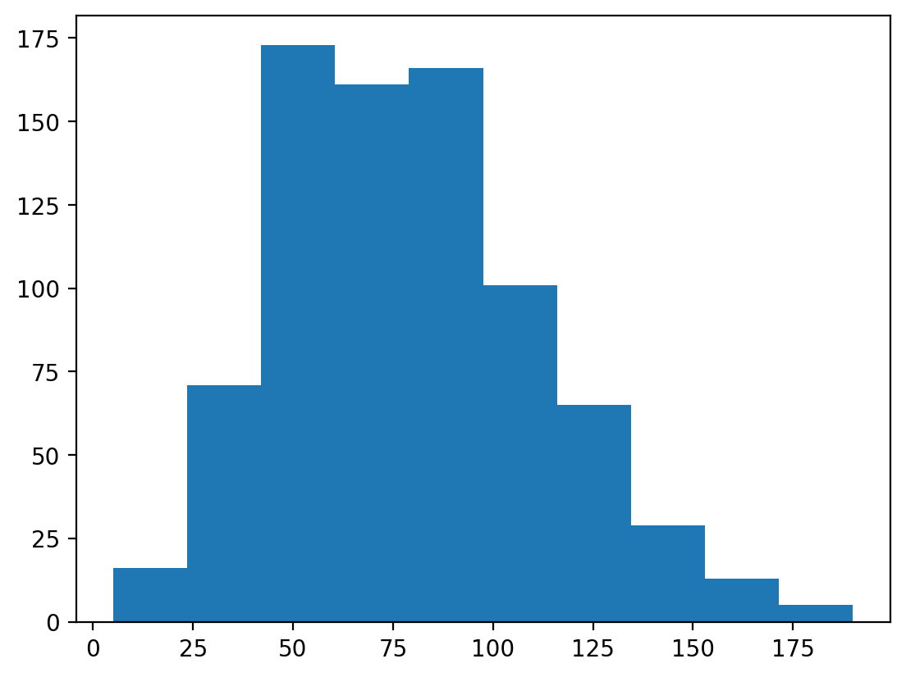
    


#### Changing the number of bins

A histogram puts your continuous data into **bins** (e.g., 1-10, 11-20, etc.).

- The height of each bin reflects the number of observations within that interval.  
- Increasing or decreasing the number of bins gives you more or less granularity in your distribution.


```python
### This has lots of bins
p = plt.hist(df_pokemon['Attack'], bins = 30)
```


    

    


```python
### This has fewer bins
p = plt.hist(df_pokemon['Attack'], bins = 5)
```


    
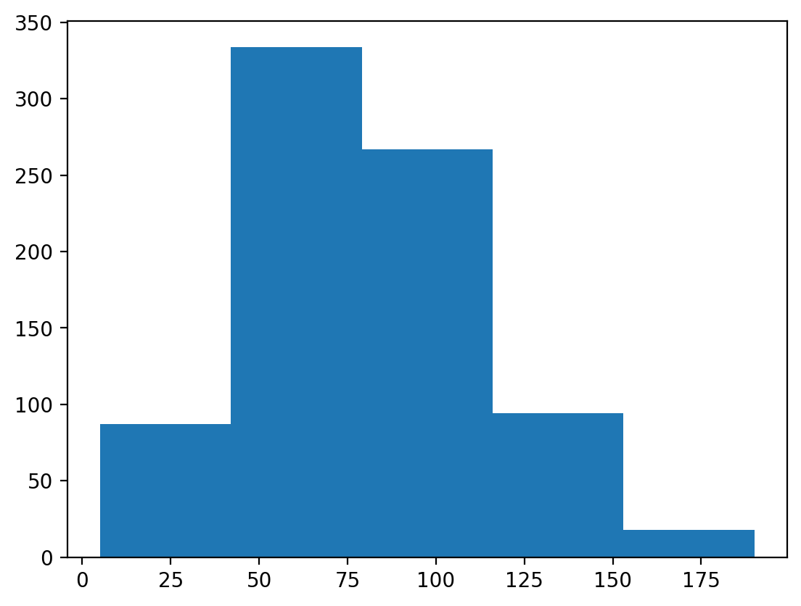
    


#### Changing the `alpha` level

The `alpha` level changes the **transparency** of your figure.


```python
### This has fewer bins
p = plt.hist(df_pokemon['Attack'], alpha = .6)
```


    

    


#### Check-in:

How would you make a histogram of the scores for `Defense`?


```python
### Your code here
p = plt.hist(df_pokemon['Defense'], alpha = .6)
```


    
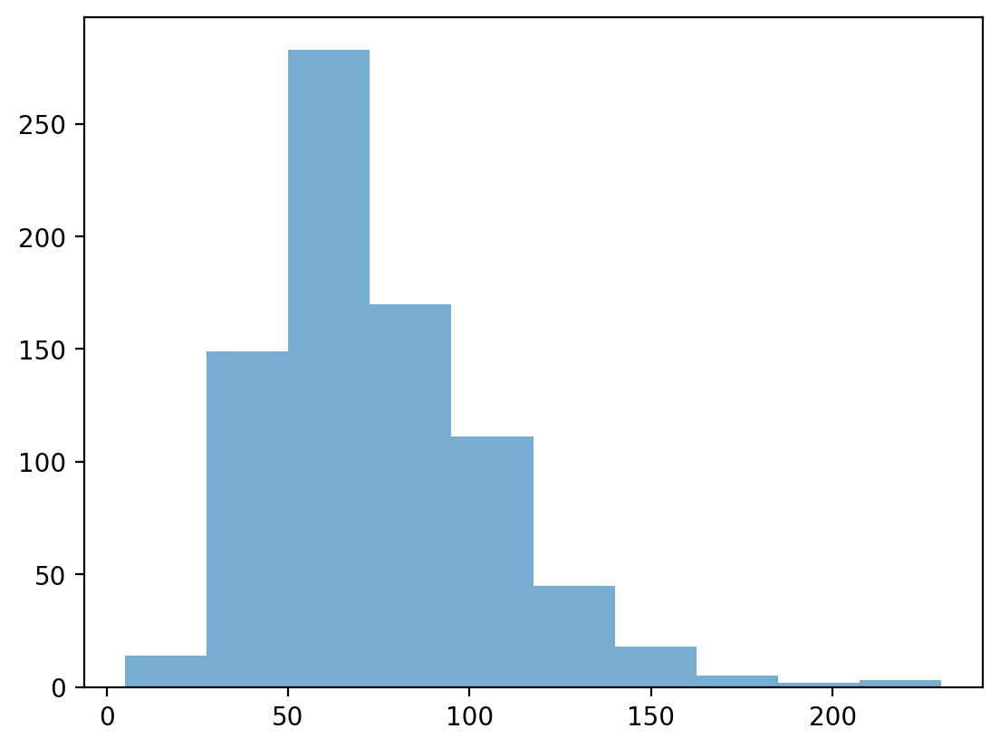
    


#### Check-in:

Could you make a histogram of the scores for `Type 1`?


```python
plt.figure(figsize=(14,8))
plt.hist(data=df_pokemon['Type 1'])
# type1 = (df_pokemon['Type 1']).value_counts()
# plt.bar(type1.index, type1.values)
```


    ---------------------------------------------------------------------------

    TypeError                                 Traceback (most recent call last)

    Cell In[10], line 2
          1 plt.figure(figsize=(14,8))
    ----> 2 plt.hist(data=df_pokemon['Type 1'])
          3 # type1 = (df_pokemon['Type 1']).value_counts()
          4 # plt.bar(type1.index, type1.values)
    

    File ~\AppData\Local\Packages\PythonSoftwareFoundation.Python.3.11_qbz5n2kfra8p0\LocalCache\local-packages\Python311\site-packages\matplotlib\_api\deprecation.py:453, in make_keyword_only.<locals>.wrapper(*args, **kwargs)
        447 if len(args) > name_idx:
        448     warn_deprecated(
        449         since, message="Passing the %(name)s %(obj_type)s "
        450         "positionally is deprecated since Matplotlib %(since)s; the "
        451         "parameter will become keyword-only in %(removal)s.",
        452         name=name, obj_type=f"parameter of {func.__name__}()")
    --> 453 return func(*args, **kwargs)
    

    TypeError: hist() missing 1 required positional argument: 'x'


    <Figure size 1400x800 with 0 Axes>


### Learning from histograms

Histograms are incredibly useful for learning about the **shape** of our distribution. We can ask questions like:

- Is this distribution relatively [normal](https://en.wikipedia.org/wiki/Normal_distribution)?
- Is the distribution [skewed](https://en.wikipedia.org/wiki/Skewness)?
- Are there [outliers](https://en.wikipedia.org/wiki/Outlier)?

#### Normally distributed data

We can use the `numpy.random.normal` function to create a **normal distribution**, then plot it.

A normal distribution has the following characteristics:

- Classic "bell" shape (**symmetric**).  
- Mean, median, and mode are all identical.


```python
norm = np.random.normal(loc = 10, scale = 1, size = 1000)
p = plt.hist(norm, alpha = .6)
```


    
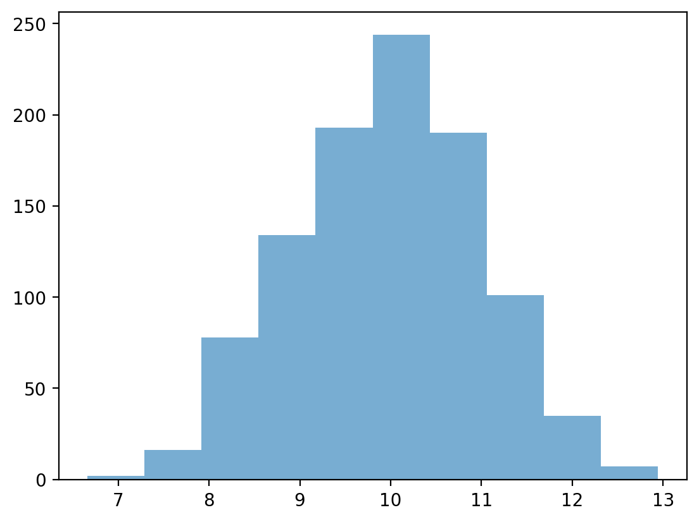
    


#### Skewed data

> **Skew** means there are values *elongating* one of the "tails" of a distribution.

- Positive/right skew: the tail is pointing to the right.  
- Negative/left skew: the tail is pointing to the left.


```python
rskew = ss.skewnorm.rvs(20, size = 1000) # make right-skewed data
lskew = ss.skewnorm.rvs(-20, size = 1000) # make left-skewed data
fig, axes = plt.subplots(1, 2)
axes[0].hist(rskew)
axes[0].set_title("Right-skewed")
axes[1].hist(lskew)
axes[1].set_title("Left-skewed")
```


    Text(0.5, 1.0, 'Left-skewed')


    
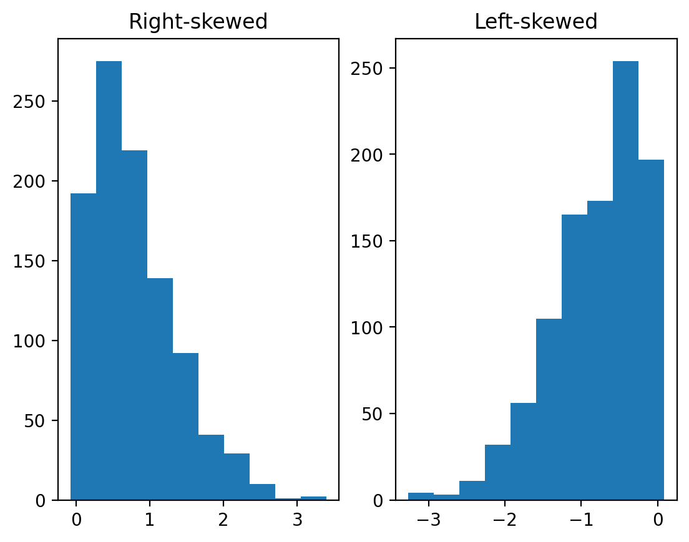
    


#### Outliers

> **Outliers** are data points that differ significantly from other points in a distribution.

- Unlike skewed data, outliers are generally **discontinuous** with the rest of the distribution.
- Next week, we'll talk about more ways to **identify** outliers; for now, we can rely on histograms.


```python
norm = np.random.normal(loc = 10, scale = 1, size = 1000)
upper_outliers = np.array([21, 21, 21, 21]) ## some random outliers
data = np.concatenate((norm, upper_outliers))
p = plt.hist(data, alpha = .6)
plt.arrow(20, 100, dx = 0, dy = -50, width = .3, head_length = 10, facecolor = "red")
```


    
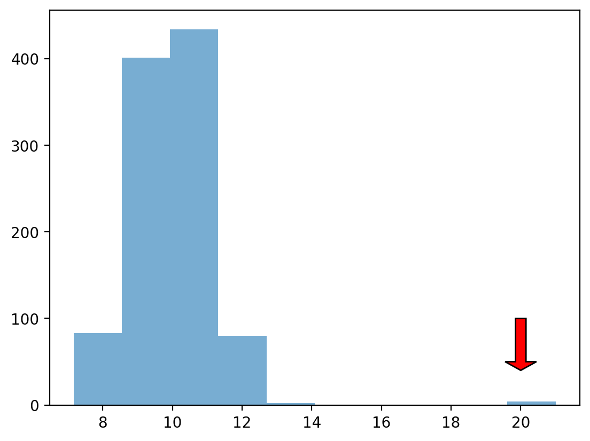
    


#### Check-in

How would you describe the following distribution?

- Normal vs. skewed?  
- With or without outliers?


```python
### Your code here
from scipy import stats
print(f"median: {np.median(data)}")
print(f"mean: {np.mean(data)}")
#i would describe following distribution as normal with outliers
```

    median: 9.965033632147573
    mean: 9.988636433675387
    

#### Check-in

In a somewhat **right-skewed distribution** (like below), what's larger––the `mean` or the `median`?


```python
mean1=np.mean(df_pokemon['Attack'])
median1=np.median(df_pokemon['Attack'])
print(mean1)
print(median1)
print(f"mean is larger than median: {mean1>median1}")
#according to the printed statement -> mean is larger than median in right-skewed distribution
```

    79.00125
    75.0
    mean is larger than median: True
    

### Modifying our plot

- A good data visualization should also make it *clear* what's being plotted.
   - Clearly labeled `x` and `y` axes, title.
- Sometimes, we may also want to add **overlays**. 
   - E.g., a dashed vertical line representing the `mean`.

#### Adding axis labels


```python
p = plt.hist(df_pokemon['Attack'], alpha = .6)
plt.xlabel("Attack")
plt.ylabel("Count")
plt.title("Distribution of Attack Scores")
```


    

    


#### Adding a vertical line

The `plt.axvline` function allows us to draw a vertical line at a particular position, e.g., the `mean` of the `Attack` column.


```python
p = plt.hist(df_pokemon['Attack'], alpha = .6)
plt.xlabel("Attack")
plt.ylabel("Count")
plt.title("Distribution of Attack Scores")
plt.axvline(df_pokemon['Attack'].mean(), linestyle = "dotted")
```


    
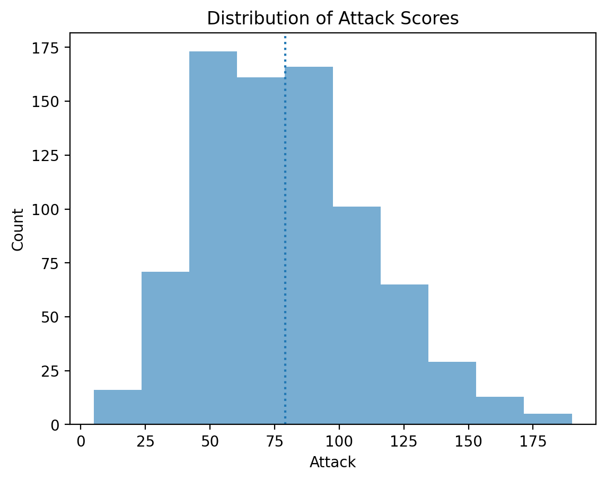
    


## Faceting for histograms

Let's try to group by our no. of Attacks by Pokemon Types looking at many histograms at a time:


```python
import plotly.express as px
fig = px.histogram(df_pokemon,x='Attack', color="Legendary", facet_col='Generation')
fig.show()
```


    ---------------------------------------------------------------------------

    ModuleNotFoundError                       Traceback (most recent call last)

    Cell In[18], line 1
    ----> 1 import plotly.express as px
          2 fig = px.histogram(df_pokemon,x='Attack', color="Legendary", facet_col='Generation')
          3 fig.show()
    

    ModuleNotFoundError: No module named 'plotly'


## Scatterplots

### What are scatterplots?

> A **scatterplot** is a visualization of how two different continuous distributions relate to each other.

- Each individual point represents an observation.
- Very useful for **exploratory data analysis**.
   - Are these variables positively or negatively correlated?
   
A scatterplot is a **bivariate** plot, i.e., it displays at least two variables.

### Scatterplots with `matplotlib`

We can create a scatterplot using `plt.scatter(x, y)`, where `x` and `y` are the two variables we want to visualize.


```python
x = np.arange(1, 10)
y = np.arange(11, 20)
p = plt.scatter(x, y)
```


    

    


#### Check-in

Are these variables related? If so, how?


```python
x = np.random.normal(loc = 10, scale = 1, size = 100)
y = x * 2 + np.random.normal(loc = 0, scale = 2, size = 100)
plt.scatter(x, y, alpha = .6)
```


    
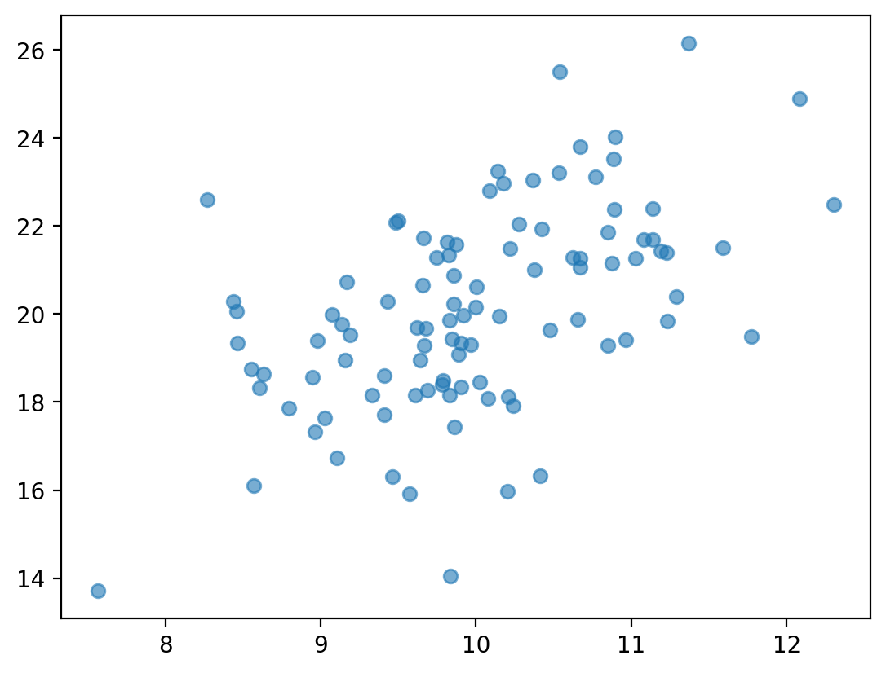
    


#### Check-in

Are these variables related? If so, how?


```python
x = np.random.normal(loc = 10, scale = 1, size = 100)
y = -x * 2 + np.random.normal(loc = 0, scale = 2, size = 100)
plt.scatter(x, y, alpha = .6)
```


    
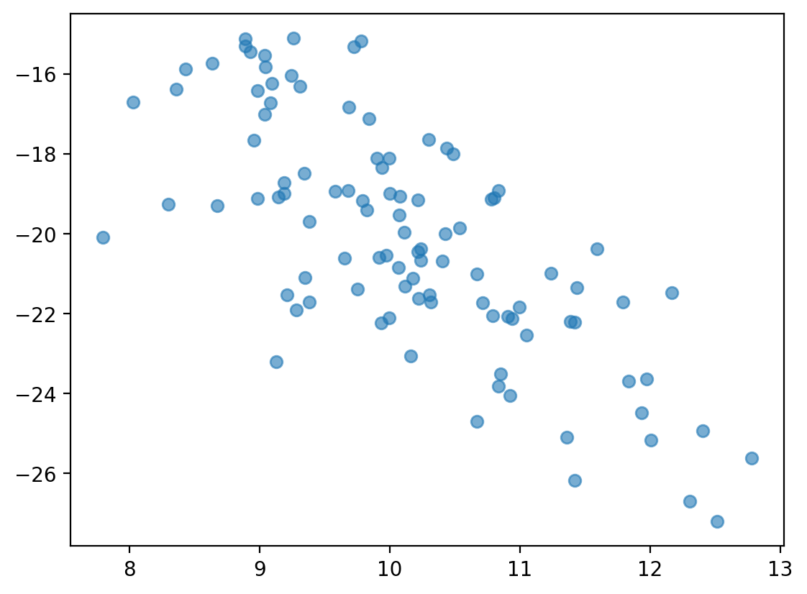
    


#### Scatterplots are useful for detecting non-linear relationships


```python
x = np.random.normal(loc = 10, scale = 1, size = 100)
y = np.sin(x)
plt.scatter(x, y, alpha = .6)
```


    
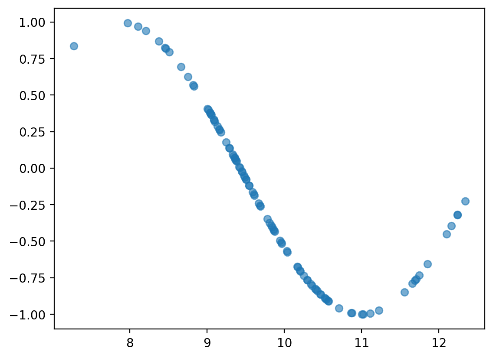
    


#### Check-in

How would we visualize the relationship between `Attack` and `Speed` in our Pokemon dataset?


```python
x = df_pokemon["Attack"]
y = df_pokemon["Speed"]
plt.xlabel("Attack")
plt.ylabel("Speed")
plt.title("Relation between Attack and Speed")
plt.scatter(x, y, alpha = .6)

```


    
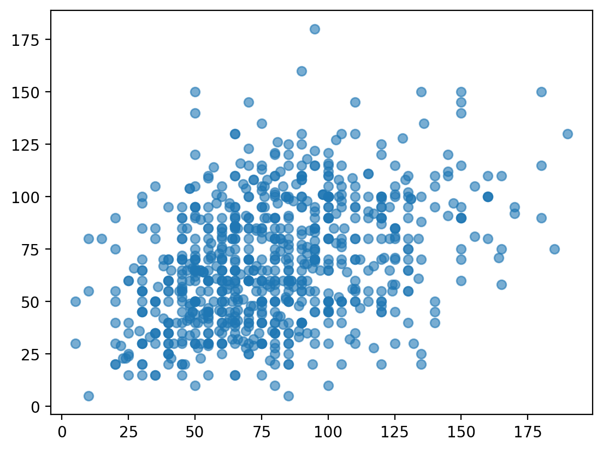
    


## Scatterplots with `pyplot express`

With pyplot express we can play with scatterplots even further - we can create `bubble plots`!


```python
import plotly.express as px
bubble=px.scatter(df_pokemon, x='Attack', y='Speed', color='Generation', size='HP')
bubble.show()
```


## Barplots

### What is a barplot?

> A **barplot** visualizes the relationship between one *continuous* variable and a *categorical* variable.

- The *height* of each bar generally indicates the mean of the continuous variable.
- Each bar represents a different *level* of the categorical variable.

A barplot is a **bivariate** plot, i.e., it displays at least two variables.

### Barplots with `matplotlib`

`plt.bar` can be used to create a **barplot** of our data.

- E.g., average `Attack` by `Legendary` status.
- However, we first need to use `groupby` to calculate the mean `Attack` per level.

#### Step 1: Using `groupby`


```python
summary = df_pokemon[['Legendary', 'Attack']].groupby("Legendary").mean().reset_index()
summary
```


<div>
<style scoped>
    .dataframe tbody tr th:only-of-type {
        vertical-align: middle;
    }

    .dataframe tbody tr th {
        vertical-align: top;
    }

    .dataframe thead th {
        text-align: right;
    }
</style>
<table border="1" class="dataframe">
  <thead>
    <tr style="text-align: right;">
      <th></th>
      <th>Legendary</th>
      <th>Attack</th>
    </tr>
  </thead>
  <tbody>
    <tr>
      <th>0</th>
      <td>False</td>
      <td>75.669388</td>
    </tr>
    <tr>
      <th>1</th>
      <td>True</td>
      <td>116.676923</td>
    </tr>
  </tbody>
</table>
</div>


```python
### Turn Legendary into a str
summary['Legendary'] = summary['Legendary'].apply(lambda x: str(x))
summary
```


<div>
<style scoped>
    .dataframe tbody tr th:only-of-type {
        vertical-align: middle;
    }

    .dataframe tbody tr th {
        vertical-align: top;
    }

    .dataframe thead th {
        text-align: right;
    }
</style>
<table border="1" class="dataframe">
  <thead>
    <tr style="text-align: right;">
      <th></th>
      <th>Legendary</th>
      <th>Attack</th>
    </tr>
  </thead>
  <tbody>
    <tr>
      <th>0</th>
      <td>False</td>
      <td>75.669388</td>
    </tr>
    <tr>
      <th>1</th>
      <td>True</td>
      <td>116.676923</td>
    </tr>
  </tbody>
</table>
</div>


#### Step 2: Pass values into `plt.bar`

**Check-in**:

- What do we learn from this plot?  
- What is this plot missing?


```python
plt.bar(x = summary['Legendary'],height = summary['Attack'],alpha = .6);
plt.xlabel("Legendary status")
plt.ylabel("Attack")
```


    Text(0, 0.5, 'Attack')


    

    


## Barplots in `plotly.express`


```python
import plotly.express as px
data_canada = px.data.gapminder().query("country == 'Canada'")
fig = px.bar(data_canada, x='year', y='pop')
fig.show()
```


```python
data_canada.head(3)
```


<div>
<style scoped>
    .dataframe tbody tr th:only-of-type {
        vertical-align: middle;
    }

    .dataframe tbody tr th {
        vertical-align: top;
    }

    .dataframe thead th {
        text-align: right;
    }
</style>
<table border="1" class="dataframe">
  <thead>
    <tr style="text-align: right;">
      <th></th>
      <th>country</th>
      <th>continent</th>
      <th>year</th>
      <th>lifeExp</th>
      <th>pop</th>
      <th>gdpPercap</th>
      <th>iso_alpha</th>
      <th>iso_num</th>
    </tr>
  </thead>
  <tbody>
    <tr>
      <th>240</th>
      <td>Canada</td>
      <td>Americas</td>
      <td>1952</td>
      <td>68.75</td>
      <td>14785584</td>
      <td>11367.16112</td>
      <td>CAN</td>
      <td>124</td>
    </tr>
    <tr>
      <th>241</th>
      <td>Canada</td>
      <td>Americas</td>
      <td>1957</td>
      <td>69.96</td>
      <td>17010154</td>
      <td>12489.95006</td>
      <td>CAN</td>
      <td>124</td>
    </tr>
    <tr>
      <th>242</th>
      <td>Canada</td>
      <td>Americas</td>
      <td>1962</td>
      <td>71.30</td>
      <td>18985849</td>
      <td>13462.48555</td>
      <td>CAN</td>
      <td>124</td>
    </tr>
  </tbody>
</table>
</div>


```python
long_df = px.data.medals_long()

fig = px.bar(long_df, x="nation", y="count", color="medal", title="Long format of data")
fig.show()

long_df.head(3)
```


<div>
<style scoped>
    .dataframe tbody tr th:only-of-type {
        vertical-align: middle;
    }

    .dataframe tbody tr th {
        vertical-align: top;
    }

    .dataframe thead th {
        text-align: right;
    }
</style>
<table border="1" class="dataframe">
  <thead>
    <tr style="text-align: right;">
      <th></th>
      <th>nation</th>
      <th>medal</th>
      <th>count</th>
    </tr>
  </thead>
  <tbody>
    <tr>
      <th>0</th>
      <td>South Korea</td>
      <td>gold</td>
      <td>24</td>
    </tr>
    <tr>
      <th>1</th>
      <td>China</td>
      <td>gold</td>
      <td>10</td>
    </tr>
    <tr>
      <th>2</th>
      <td>Canada</td>
      <td>gold</td>
      <td>9</td>
    </tr>
  </tbody>
</table>
</div>


```python
wide_df = px.data.medals_wide()

fig = px.bar(wide_df, x="nation", y=["gold", "silver", "bronze"], title="Wide format of data")
fig.show()

wide_df.head(3)
```


<div>
<style scoped>
    .dataframe tbody tr th:only-of-type {
        vertical-align: middle;
    }

    .dataframe tbody tr th {
        vertical-align: top;
    }

    .dataframe thead th {
        text-align: right;
    }
</style>
<table border="1" class="dataframe">
  <thead>
    <tr style="text-align: right;">
      <th></th>
      <th>nation</th>
      <th>gold</th>
      <th>silver</th>
      <th>bronze</th>
    </tr>
  </thead>
  <tbody>
    <tr>
      <th>0</th>
      <td>South Korea</td>
      <td>24</td>
      <td>13</td>
      <td>11</td>
    </tr>
    <tr>
      <th>1</th>
      <td>China</td>
      <td>10</td>
      <td>15</td>
      <td>8</td>
    </tr>
    <tr>
      <th>2</th>
      <td>Canada</td>
      <td>9</td>
      <td>12</td>
      <td>12</td>
    </tr>
  </tbody>
</table>
</div>


## Faceting barplots

Please use faceting for the Pokemon data with barplots:


```python
fig = px.bar(df_pokemon, x='Type 1', facet_row='Legendary')
fig.show()
 
```


For more information please go to the tutorial [Plotly Express Wide-Form Support in Python](https://plotly.com/python/wide-form/).

## Conclusion

This concludes our first introduction to **data visualization**:

- Working with `matplotlib.pyplot`.  
- Working with more convenient version of `pyplot.express`.
- Creating basic plots: histograms, scatterplots, and barplots.

Next time, we'll move onto discussing `seaborn`, another very useful package for data visualization.

Analysis of different data visualtisation graphs and methods.


```python
#1. Histogram
print("\nThis histogram shows that most HP values are around the mean and there are not so much extrem values.\nWe can can visually see that without calculating anything.")
fig = px.histogram(df_pokemon, x="HP", nbins=20, title="HP distribution among pokemons")
fig.show()

print("Now we will try to get those outliers with extreme HP values and plot them. We decided to take a threshold based on 1.5 times the interquartile range because it seemed like a reasonable choice to detect values that are far from the rest of the data.\n")

#Outliers for HP
Q1 = df_pokemon['HP'].quantile(0.25)#1st quartile
Q3 = df_pokemon['HP'].quantile(0.75)#3rd
pokeRangeQ1Q3 = Q3 - Q1

lower_bound = Q1 - 1.5 * pokeRangeQ1Q3
upper_bound = Q3 + 1.5 * pokeRangeQ1Q3
outliers = df_pokemon[(df_pokemon['HP'] < lower_bound) | (df_pokemon['HP'] > upper_bound)]
print(outliers[['Name', 'HP', 'Type 1']])


print("\n\nThis bubble plot helps us visualize where are the strong pokemons with big HP regarding the Attack Defense values.")
# Scatter plot for all pokemons
df_pokemon['is_outlier_HP'] = (df_pokemon['HP'] < lower_bound) | (df_pokemon['HP'] > upper_bound)

# Scatter plot
fig = px.scatter(df_pokemon,
                 x='Attack',
                 y='Defense',
                 size='HP',               
                 color='is_outlier_HP',# Color is different if outlier
                 hover_name='Name',        
                 title="Who has lot HP ")

fig.show()
```

    
    This histogram shows that most HP values are around the mean and there are not so much extrem values.
    We can can visually see that without calculating anything.
    


    Now we will try to get those outliers with extreme HP values and plot them. We decided to take a threshold based on 1.5 times the interquartile range because it seemed like a reasonable choice to detect values that are far from the rest of the data.
    
                          Name   HP    Type 1
    45              Wigglytuff  140    Normal
    121                Chansey  250    Normal
    142                 Lapras  130     Water
    145               Vaporeon  130     Water
    155                Snorlax  160    Normal
    217              Wobbuffet  190   Psychic
    261                Blissey  255    Normal
    313                Slaking  150    Normal
    316               Shedinja    1       Bug
    321               Hariyama  144  Fighting
    350                Wailmer  130     Water
    351                Wailord  170     Water
    473               Drifblim  150     Ghost
    495               Munchlax  135    Normal
    544  GiratinaAltered Forme  150     Ghost
    545   GiratinaOrigin Forme  150     Ghost
    655              Alomomola  165     Water
    792                Xerneas  126     Fairy
    793                Yveltal  126      Dark
    
    
    This bubble plot helps us visualize where are the strong pokemons with big HP regarding the Attack Defense values.
    


```python
# Bar plot of outliers HP

print("\nAdditionally, we can compare the outliers defined above to each other.")
print("We can easily visualize that most outliers have a similar amount of HP.")
print("However, 3 Pokemon stand out: Chansey, Blissey, and Shedinja. The two first\nones are very big whereas Shedinja is very fragile !")

fig = px.bar(outliers, 
             x='Name', 
             y='HP', 
             color='Type 1', 
             title='Pokemon with extreme HP Values (outliers)',
             labels={'HP':'HP Value', 'Name':'Pokémon Name'})

fig.update_layout(xaxis_tickangle=-45)
fig.show()
```

    
    Additionally, we can compare the outliers defined above to each other.
    We can easily visualize that most outliers have a similar amount of HP.
    However, 3 Pokemon stand out: Chansey, Blissey, and Shedinja. The two first
    ones are very big whereas Shedinja is very fragile !
    


# Data visualization, pt. 2 (`seaborn`)

## Goals of this exercise

- Introducting `seaborn`. 
- Putting `seaborn` into practice:
  - **Univariate** plots (histograms).  
  - **Bivariate** continuous plots (scatterplots and line plots).
  - **Bivariate** categorical plots (bar plots, box plots, and strip plots).

## Introducing `seaborn`

### What is `seaborn`?

> [`seaborn`](https://seaborn.pydata.org/) is a data visualization library based on `matplotlib`.

- In general, it's easier to make nice-looking graphs with `seaborn`.
- The trade-off is that `matplotlib` offers more flexibility.


```python
import seaborn as sns ### importing seaborn
import pandas as pd
import matplotlib.pyplot as plt ## just in case we need it
import numpy as np
```


```python
%matplotlib inline 
%config InlineBackend.figure_format = 'retina'
```

### The `seaborn` hierarchy of plot types

We'll learn more about exactly what this hierarchy means today (and in next lecture).


### Example dataset

Today we'll work with a new dataset, from [Gapminder](https://www.gapminder.org/data/documentation/). 

- **Gapminder** is an independent Swedish foundation dedicated to publishing and analyzing data to correct misconceptions about the world.
- Between 1952-2007, has data about `life_exp`, `gdp_cap`, and `population`.


```python
df_gapminder = pd.read_csv("gapminder_full.csv")
```


    ---------------------------------------------------------------------------

    FileNotFoundError                         Traceback (most recent call last)

    ~\AppData\Local\Temp/ipykernel_45568/1205863771.py in <module>
    ----> 1 df_gapminder = pd.read_csv("gapminder_full.csv")
    

    ~\anaconda3\lib\site-packages\pandas\util\_decorators.py in wrapper(*args, **kwargs)
        309                     stacklevel=stacklevel,
        310                 )
    --> 311             return func(*args, **kwargs)
        312 
        313         return wrapper
    

    ~\anaconda3\lib\site-packages\pandas\io\parsers\readers.py in read_csv(filepath_or_buffer, sep, delimiter, header, names, index_col, usecols, squeeze, prefix, mangle_dupe_cols, dtype, engine, converters, true_values, false_values, skipinitialspace, skiprows, skipfooter, nrows, na_values, keep_default_na, na_filter, verbose, skip_blank_lines, parse_dates, infer_datetime_format, keep_date_col, date_parser, dayfirst, cache_dates, iterator, chunksize, compression, thousands, decimal, lineterminator, quotechar, quoting, doublequote, escapechar, comment, encoding, encoding_errors, dialect, error_bad_lines, warn_bad_lines, on_bad_lines, delim_whitespace, low_memory, memory_map, float_precision, storage_options)
        584     kwds.update(kwds_defaults)
        585 
    --> 586     return _read(filepath_or_buffer, kwds)
        587 
        588 
    

    ~\anaconda3\lib\site-packages\pandas\io\parsers\readers.py in _read(filepath_or_buffer, kwds)
        480 
        481     # Create the parser.
    --> 482     parser = TextFileReader(filepath_or_buffer, **kwds)
        483 
        484     if chunksize or iterator:
    

    ~\anaconda3\lib\site-packages\pandas\io\parsers\readers.py in __init__(self, f, engine, **kwds)
        809             self.options["has_index_names"] = kwds["has_index_names"]
        810 
    --> 811         self._engine = self._make_engine(self.engine)
        812 
        813     def close(self):
    

    ~\anaconda3\lib\site-packages\pandas\io\parsers\readers.py in _make_engine(self, engine)
       1038             )
       1039         # error: Too many arguments for "ParserBase"
    -> 1040         return mapping[engine](self.f, **self.options)  # type: ignore[call-arg]
       1041 
       1042     def _failover_to_python(self):
    

    ~\anaconda3\lib\site-packages\pandas\io\parsers\c_parser_wrapper.py in __init__(self, src, **kwds)
         49 
         50         # open handles
    ---> 51         self._open_handles(src, kwds)
         52         assert self.handles is not None
         53 
    

    ~\anaconda3\lib\site-packages\pandas\io\parsers\base_parser.py in _open_handles(self, src, kwds)
        220         Let the readers open IOHandles after they are done with their potential raises.
        221         """
    --> 222         self.handles = get_handle(
        223             src,
        224             "r",
    

    ~\anaconda3\lib\site-packages\pandas\io\common.py in get_handle(path_or_buf, mode, encoding, compression, memory_map, is_text, errors, storage_options)
        700         if ioargs.encoding and "b" not in ioargs.mode:
        701             # Encoding
    --> 702             handle = open(
        703                 handle,
        704                 ioargs.mode,
    

    FileNotFoundError: [Errno 2] No such file or directory: 'gapminder_full.csv'


```python
df_gapminder.head(2)
```


```python
df_gapminder.shape
```

## Univariate plots

> A **univariate plot** is a visualization of only a *single* variable, i.e., a **distribution**.


### Histograms with `sns.histplot`

- We've produced histograms with `plt.hist`.  
- With `seaborn`, we can use `sns.histplot(...)`.

Rather than use `df['col_name']`, we can use the syntax:

```python
sns.histplot(data = df, x = col_name)
```

This will become even more useful when we start making **bivariate plots**.


```python
# Histogram of life expectancy
sns.histplot(df_gapminder['life_exp']);
```

#### Modifying the number of bins

As with `plt.hist`, we can modify the number of *bins*.


```python
# Fewer bins
sns.histplot(data = df_gapminder, x = 'life_exp', bins = 10, alpha = .6);
```


```python
# Many more bins!
sns.histplot(data = df_gapminder, x = 'life_exp', bins = 100, alpha = .6)
```

#### Modifying the y-axis with `stat`

By default, `sns.histplot` will plot the **count** in each bin. However, we can change this using the `stat` parameter:

- `probability`: normalize such that bar heights sum to `1`.
- `percent`: normalize such that bar heights sum to `100`.
- `density`: normalize such that total *area* sums to `1`.


```python
# Note the modified y-axis!
sns.histplot(data = df_gapminder, x = 'life_exp', stat = "probability", alpha = .6)
```


    ---------------------------------------------------------------------------

    NameError                                 Traceback (most recent call last)

    ~\AppData\Local\Temp/ipykernel_45568/693073458.py in <module>
          1 # Note the modified y-axis!
    ----> 2 sns.histplot(data = df_gapminder, x = 'life_exp', stat = "probability", alpha = .6)
    

    NameError: name 'df_gapminder' is not defined


### Check-in

How would you make a histogram showing the distribution of `population` values in `2007` alone? 

- Bonus 1: Modify this graph to show `probability`, not `count`.
- Bonus 2: What do you notice about this graph, and how might you change it?


```python
df_2007 = df_gapminder[df_gapminder['year'] == 2007]

# changing xscale to 'log'(from the default 'linear') made the graph more readable
# before the change we could observe that the majority of the countries had a small population in 2007
# but there were some countries whose population then was significantly bigger which caused
# that a lot of data was squeezed on the left side and some singular data was shown on the far right
# changing to 'log' spreaded every singular datum so that they're more or less near one another

plt.figure(figsize=(10,6))
sns.histplot(data=df_2007, x='population', stat='probability', bins=50)
plt.xscale('log')
plt.title('Distribution of Population in 2007 (Probability)')
plt.xlabel('Population')
plt.ylabel('Probability')
plt.show()

plt.figure(figsize=(10,6))
sns.histplot(data=df_2007, x='population', bins=50)
plt.xscale('log')
plt.title('Distribution of Population in 2007')
plt.xlabel('Population')
plt.ylabel('Count')
plt.show()
```


    ---------------------------------------------------------------------------

    NameError                                 Traceback (most recent call last)

    ~\AppData\Local\Temp/ipykernel_45568/3641876699.py in <module>
    ----> 1 df_2007 = df_gapminder[df_gapminder['year'] == 2007]
          2 
          3 # changing xscale to 'log'(from the default 'linear') made the graph more readable
          4 # before the change we could observe that the majority of the countries had a small population in 2007
          5 # but there were some countries whose population then was significantly bigger which caused
    

    NameError: name 'df_gapminder' is not defined


## Bivariate continuous plots

> A **bivariate continuous plot** visualizes the relationship between *two continuous variables*.


### Scatterplots with `sns.scatterplot`

> A **scatterplot** visualizes the relationship between two continuous variables.

- Each observation is plotted as a single dot/mark. 
- The position on the `(x, y)` axes reflects the value of those variables.

One way to make a scatterplot in `seaborn` is using `sns.scatterplot`.

#### Showing `gdp_cap` by `life_exp`

What do we notice about `gdp_cap`?


```python
sns.scatterplot(data = df_gapminder, x = 'gdp_cap',
               y = 'life_exp', alpha = .3);
```


    ---------------------------------------------------------------------------

    NameError                                 Traceback (most recent call last)

    ~\AppData\Local\Temp/ipykernel_45568/960769122.py in <module>
    ----> 1 sns.scatterplot(data = df_gapminder, x = 'gdp_cap',
          2                y = 'life_exp', alpha = .3);
    

    NameError: name 'df_gapminder' is not defined


#### Showing `gdp_cap_log` by `life_exp`


```python
## Log GDP
df_gapminder['gdp_cap_log'] = np.log10(df_gapminder['gdp_cap']) 
## Show log GDP by life exp
sns.scatterplot(data = df_gapminder, x = 'gdp_cap_log', y = 'life_exp', alpha = .3);
```


    ---------------------------------------------------------------------------

    NameError                                 Traceback (most recent call last)

    ~\AppData\Local\Temp/ipykernel_45568/1354961121.py in <module>
          1 ## Log GDP
    ----> 2 df_gapminder['gdp_cap_log'] = np.log10(df_gapminder['gdp_cap'])
          3 ## Show log GDP by life exp
          4 sns.scatterplot(data = df_gapminder, x = 'gdp_cap_log', y = 'life_exp', alpha = .3);
    

    NameError: name 'df_gapminder' is not defined


#### Adding a `hue`

- What if we want to add a *third* component that's categorical, like `continent`?
- `seaborn` allows us to do this with `hue`.


```python
## Log GDP
df_gapminder['gdp_cap_log'] = np.log10(df_gapminder['gdp_cap']) 
## Show log GDP by life exp
sns.scatterplot(data = df_gapminder[df_gapminder['year'] == 2007],
               x = 'gdp_cap_log', y = 'life_exp', hue = "continent", alpha = .7);
```


    ---------------------------------------------------------------------------

    NameError                                 Traceback (most recent call last)

    ~\AppData\Local\Temp/ipykernel_45568/2210440022.py in <module>
          1 ## Log GDP
    ----> 2 df_gapminder['gdp_cap_log'] = np.log10(df_gapminder['gdp_cap'])
          3 ## Show log GDP by life exp
          4 sns.scatterplot(data = df_gapminder[df_gapminder['year'] == 2007],
          5                x = 'gdp_cap_log', y = 'life_exp', hue = "continent", alpha = .7);
    

    NameError: name 'df_gapminder' is not defined


#### Adding a `size`

- What if we want to add a *fourth* component that's continuous, like `population`?
- `seaborn` allows us to do this with `size`.


```python
## Log GDP
df_gapminder['gdp_cap_log'] = np.log10(df_gapminder['gdp_cap']) 
## Show log GDP by life exp
sns.scatterplot(data = df_gapminder[df_gapminder['year'] == 2007],
               x = 'gdp_cap_log', y = 'life_exp',
                hue = "continent", size = 'population', alpha = .7);
```


    ---------------------------------------------------------------------------

    NameError                                 Traceback (most recent call last)

    ~\AppData\Local\Temp/ipykernel_45568/2557269679.py in <module>
          1 ## Log GDP
    ----> 2 df_gapminder['gdp_cap_log'] = np.log10(df_gapminder['gdp_cap'])
          3 ## Show log GDP by life exp
          4 sns.scatterplot(data = df_gapminder[df_gapminder['year'] == 2007],
          5                x = 'gdp_cap_log', y = 'life_exp',
    

    NameError: name 'df_gapminder' is not defined


#### Changing the position of the legend


```python
## Show log GDP by life exp
sns.scatterplot(data = df_gapminder[df_gapminder['year'] == 2007],
               x = 'gdp_cap_log', y = 'life_exp',
                hue = "continent", size = 'population', alpha = .7)

plt.legend(bbox_to_anchor=(1.05, 1), loc='upper left', borderaxespad=0)
```


    <matplotlib.legend.Legend at 0x1b3175b3b50>


    

    


### Lineplots with `sns.lineplot`

> A **lineplot** also visualizes the relationship between two continuous variables.

- Typically, the position of the line on the `y` axis reflects the *mean* of the `y`-axis variable for that value of `x`.
- Often used for plotting **change over time**.

One way to make a lineplot in `seaborn` is using [`sns.lineplot`](https://seaborn.pydata.org/generated/seaborn.lineplot.html).

#### Showing `life_exp` by `year`

What general trend do we notice?


```python
sns.lineplot(data = df_gapminder,
             x = 'year',
             y = 'life_exp');
```


    

    


#### Modifying how error/uncertainty is displayed

- By default, `seaborn.lineplot` will draw **shading** around the line representing a confidence interval.
- We can change this with `errstyle`.


```python
sns.lineplot(data = df_gapminder,
             x = 'year',
             y = 'life_exp',
            err_style = "bars");
```


    

    


#### Adding a `hue`

- We could also show this by `continent`.  
- There's (fortunately) a positive trend line for each `continent`.


```python
sns.lineplot(data = df_gapminder,
             x = 'year',
             y = 'life_exp',
            hue = "continent")
plt.legend(bbox_to_anchor=(1.05, 1), loc='upper left', borderaxespad=0)
```


    <matplotlib.legend.Legend at 0x1b30f113cd0>


    

    


#### Check-in

How would you plot the relationship between `year` and `gdp_cap` for countries in the `Americas` only?


```python
### Your code here
americasGDP_df = df_gapminder[df_gapminder['continent'] == 'Americas']

sns.lineplot(data=americasGDP_df,
             x = "year", 
             y = "gdp_cap",
             hue = "country")
plt.legend(bbox_to_anchor=(1.05, 1), loc='upper left', borderaxespad=0)
plt.title("GDP per country by years (lineplot)")

plt.figure()

sns.scatterplot(data=americasGDP_df,
                x = "year",
                y = "gdp_cap",
                hue = "country",
                size="population")
plt.legend(bbox_to_anchor=(1.05, 1), loc='upper left', borderaxespad=0)

pivot_table = americasGDP_df.pivot_table(values='gdp_cap', index='country', columns='year')

plt.figure(figsize=(14, 10))
sns.heatmap(pivot_table,
            cmap='viridis',
            linewidths=0.5,
            annot=False)
plt.title('GDP per Capita Heatmap for Americas')
plt.xlabel('Year')
plt.ylabel('Country')
plt.tight_layout()
plt.show()

# for me the easiest graph to decipher is the heatmap, it may be slightly harder to 
# see rise/fall of GDP in comparison to other countries however with so many
# countries to show on a graph the heatmap is the clearest for seeing every data

```


    

    


    

    


    

    


#### Heteroskedasticity in `gdp_cap` by `year`

- [**Heteroskedasticity**](https://en.wikipedia.org/wiki/Homoscedasticity_and_heteroscedasticity) is when the *variance* in one variable (e.g., `gdp_cap`) changes as a function of another variable (e.g., `year`).
- In this case, why do you think that is?

#### Plotting by country

- There are too many countries to clearly display in the `legend`. 
- But the top two lines are the `United States` and `Canada`.
   - I.e., two countries have gotten much wealthier per capita, while the others have not seen the same economic growth.


```python
sns.lineplot(data = df_gapminder[df_gapminder['continent']=="Americas"],
             x = 'year', y = 'gdp_cap', hue = "country", legend = None);
```


    

    


### Using `replot`

- `relplot` allows you to plot either line plots or scatter plots using `kind`.
- `relplot` also makes it easier to `facet` (which we'll discuss momentarily).


```python
sns.relplot(data = df_gapminder, x = "year", y = "life_exp", kind = "line");
```


    

    


#### Faceting into `rows` and `cols`

We can also plot the same relationship across multiple "windows" or **facets** by adding a `rows`/`cols` parameter.


```python
sns.relplot(data = df_gapminder, x = "year", y = "life_exp", kind = "line", col = "continent");
```


    

    


## Bivariate categorical plots

> A **bivariate categorical plot** visualizes the relationship between one categorical variable and one continuous variable.


### Example dataset

Here, we'll return to our Pokemon dataset, which has more examples of categorical variables.


```python
df_pokemon = pd.read_csv("pokemon.csv")
```


    ---------------------------------------------------------------------------

    FileNotFoundError                         Traceback (most recent call last)

    ~\AppData\Local\Temp/ipykernel_45568/4226952659.py in <module>
    ----> 1 df_pokemon = pd.read_csv("pokemon.csv")
    

    ~\anaconda3\lib\site-packages\pandas\util\_decorators.py in wrapper(*args, **kwargs)
        309                     stacklevel=stacklevel,
        310                 )
    --> 311             return func(*args, **kwargs)
        312 
        313         return wrapper
    

    ~\anaconda3\lib\site-packages\pandas\io\parsers\readers.py in read_csv(filepath_or_buffer, sep, delimiter, header, names, index_col, usecols, squeeze, prefix, mangle_dupe_cols, dtype, engine, converters, true_values, false_values, skipinitialspace, skiprows, skipfooter, nrows, na_values, keep_default_na, na_filter, verbose, skip_blank_lines, parse_dates, infer_datetime_format, keep_date_col, date_parser, dayfirst, cache_dates, iterator, chunksize, compression, thousands, decimal, lineterminator, quotechar, quoting, doublequote, escapechar, comment, encoding, encoding_errors, dialect, error_bad_lines, warn_bad_lines, on_bad_lines, delim_whitespace, low_memory, memory_map, float_precision, storage_options)
        584     kwds.update(kwds_defaults)
        585 
    --> 586     return _read(filepath_or_buffer, kwds)
        587 
        588 
    

    ~\anaconda3\lib\site-packages\pandas\io\parsers\readers.py in _read(filepath_or_buffer, kwds)
        480 
        481     # Create the parser.
    --> 482     parser = TextFileReader(filepath_or_buffer, **kwds)
        483 
        484     if chunksize or iterator:
    

    ~\anaconda3\lib\site-packages\pandas\io\parsers\readers.py in __init__(self, f, engine, **kwds)
        809             self.options["has_index_names"] = kwds["has_index_names"]
        810 
    --> 811         self._engine = self._make_engine(self.engine)
        812 
        813     def close(self):
    

    ~\anaconda3\lib\site-packages\pandas\io\parsers\readers.py in _make_engine(self, engine)
       1038             )
       1039         # error: Too many arguments for "ParserBase"
    -> 1040         return mapping[engine](self.f, **self.options)  # type: ignore[call-arg]
       1041 
       1042     def _failover_to_python(self):
    

    ~\anaconda3\lib\site-packages\pandas\io\parsers\c_parser_wrapper.py in __init__(self, src, **kwds)
         49 
         50         # open handles
    ---> 51         self._open_handles(src, kwds)
         52         assert self.handles is not None
         53 
    

    ~\anaconda3\lib\site-packages\pandas\io\parsers\base_parser.py in _open_handles(self, src, kwds)
        220         Let the readers open IOHandles after they are done with their potential raises.
        221         """
    --> 222         self.handles = get_handle(
        223             src,
        224             "r",
    

    ~\anaconda3\lib\site-packages\pandas\io\common.py in get_handle(path_or_buf, mode, encoding, compression, memory_map, is_text, errors, storage_options)
        700         if ioargs.encoding and "b" not in ioargs.mode:
        701             # Encoding
    --> 702             handle = open(
        703                 handle,
        704                 ioargs.mode,
    

    FileNotFoundError: [Errno 2] No such file or directory: 'pokemon.csv'


### Barplots with `sns.barplot`

> A **barplot** visualizes the relationship between one *continuous* variable and a *categorical* variable.

- The *height* of each bar generally indicates the mean of the continuous variable.
- Each bar represents a different *level* of the categorical variable.

With `seaborn`, we can use the function `sns.barplot`.

#### Average `Attack` by `Legendary` status


```python
sns.barplot(data = df_pokemon,
           x = "Legendary", y = "Attack");
```


    

    


#### Average `Attack` by `Type 1`

Here, notice that I make the figure *bigger*, to make sure the labels all fit.


```python
plt.figure(figsize=(15,4))
sns.barplot(data = df_pokemon,
           x = "Type 1", y = "Attack");
```


    

    


#### Check-in

How would you plot `HP` by `Type 1`?


```python
### Your code here
plt.figure(figsize=(15,4))
sns.barplot(data = df_pokemon,
           x = "Type 1", y = "HP");

```


    

    


#### Modifying `hue`

As with `scatterplot` and `lineplot`, we can change the `hue` to give further granularity.

- E.g., `HP` by `Type 1`, further divided by `Legendary` status.


```python
plt.figure(figsize=(15,4))
sns.barplot(data = df_pokemon,
           x = "Type 1", y = "HP", hue = "Legendary");
```


    

    


### Using `catplot`

> `seaborn.catplot` is a convenient function for plotting bivariate categorical data using a range of plot types (`bar`, `box`, `strip`).


```python
sns.catplot(data = df_pokemon, x = "Legendary", 
             y = "Attack", kind = "bar");
```


    

    


#### `strip` plots

> A `strip` plot shows each individual point (like a scatterplot), divided by a **category label**.


```python
sns.catplot(data = df_pokemon, x = "Legendary", 
             y = "Attack", kind = "strip", alpha = .5);
```


    

    


#### Adding a `mean` to our `strip` plot

We can plot *two graphs* at the same time, showing both the individual points and the means.


```python
sns.catplot(data = df_pokemon, x = "Legendary", 
             y = "Attack", kind = "strip", alpha = .1)
sns.pointplot(data = df_pokemon, x = "Legendary", 
             y = "Attack", hue = "Legendary");
```


    

    


#### `box` plots

> A `box` plot shows the interquartile range (the middle 50% of the data), along with the minimum and maximum.


```python
sns.catplot(data = df_pokemon, x = "Legendary", 
             y = "Attack", kind = "box");
```


    

    


## Conclusion

As with our lecture on `pyplot`, this just scratches the surface.

But now, you've had an introduction to:

- The `seaborn` package.
- Plotting both **univariate** and **bivariate** data.
- Creating plots with multiple layers.
